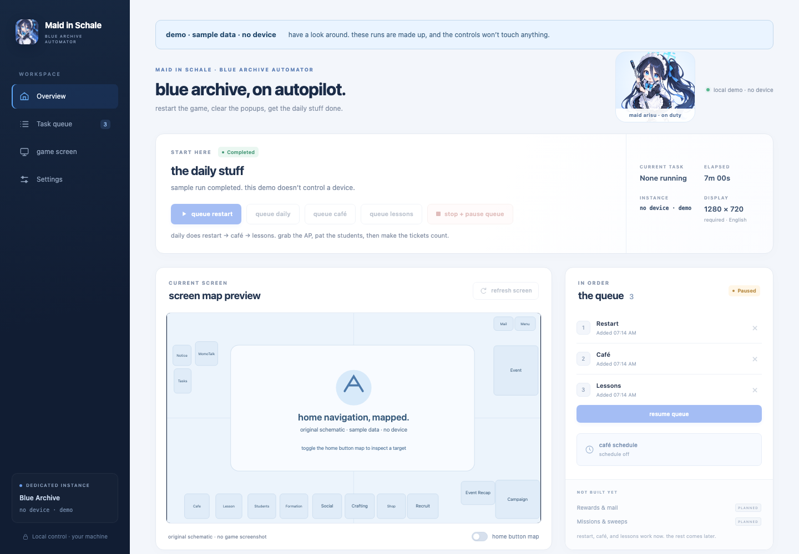

# blue archive automator

[](https://github.com/davidmwest/blue-archive-automator/actions/workflows/tests.yml)

blue archive has a lot of daily clicking. i'd like the computer to handle it, leave a useful record of what happened, and close the game when it's done.

this is a local Python automator built around BlueStacks, ADB, OpenCV, and local OCR. jobs go into one queue and run one at a time. [ALAS](https://github.com/LmeSzinc/AzurLaneAutoScript) is the model: recognize the screen, do one thing, check what happened. no LLM calls in the runtime.

**[high-level design](docs/design.md)** · [engineering notes](docs/engineering.md) · [setup](docs/getting-started.md) · [contributing](CONTRIBUTING.md)

## have a look



*sample data, original artwork. this is the same dashboard frontend, with a separate read-only server behind it.*

the demo needs Python 3.11+, but no packages, emulator, account, or local config. from the repo directory:

```sh
python3.11 -m ba_automator.demo
```

on Windows: `py -3.11 -m ba_automator.demo`. open [localhost:8766](http://127.0.0.1:8766), look through the queue, important actions, popup evidence, and home map. controls that would change anything are disabled. Ctrl+C stops it.

## what works

| piece | current behavior |
| --- | --- |
| restart | closes and relaunches the game, accepts required data downloads, dismisses startup popups, verifies a clear home screen |
| cafe | restarts first, collects available AP and credits, scans both unlocked floors for relationship icons, returns home |
| lessons | surveys locations before each ticket; defaults to the most owned students, with lowest-school-rank leveling as an option |
| dashboard | serial queue, pause/stop controls, settings, screenshots, and persistent important-action history |
| scheduling | optional Cafe visits every three hours plus 15 seconds, bounded failure retries, optional game closure between visits |
| event profiles | reviewed JSON and recognition helpers; navigation and farming are still to come |

restart, a complete two-floor Cafe visit, and the relationship-focused Lessons routine have passed live on the development Mac. seven lesson tickets were tested with verified receipts; the final run reached zero tickets, returned home, and closed the game. offline tests run on macOS, Windows, and Ubuntu. actual school rank-up popups, live Windows operation, running beside ALAS, and a complete free invitation still need verification. a completed scan and a verified relationship increase are different results; the logs keep them separate.

`daily` runs restart → cafe → lessons. the three-hour cafe schedule stays cafe-only. lessons can also be queued on their own, with a ticket limit and optional location list. it uses the tickets you already have; it never buys more. [how the lesson strategies work →](docs/lessons.md)

the first profile is the global English game at **1280×720, 320 DPI**. use a dedicated BlueStacks instance and sign in manually once. Blue Archive and Azur Lane get different ADB endpoints; they can share a compatible host ADB server. [setup and commands →](docs/getting-started.md)

## why it's built this way

- **check the result.** taps need a recognized screen and a fresh frame. downloads, popups, and camera movement get explicit verification and bounded retries.
- **measure the camera.** Cafe furniture is arbitrary, so room coverage follows observed motion and overlapping views. unknown movement never counts as a camera boundary.
- **look before spending.** lessons checks the schools before choosing a room, verifies the total rank matches the survey, then plans one ticket at a time. the scoring rules run without an emulator and have their own tests.
- **leave evidence.** important actions, before/after popup images, reward receipts, and failure reasons make a run inspectable afterward.
- **keep it local.** the real dashboard binds to loopback. the demo cannot reach a device. event rules are researched ahead of time and stored as data.

[the engineering notes](docs/engineering.md) walk through the missed-student bug and the camera fix. [the design](docs/design.md) sets the task contracts and build order; [the architecture](docs/architecture.md) describes the code that exists today.

## what's next

capture an actual school rank-up, repeat Cafe visits after cooldown, and finish the free-invitation check. configured mission sweeps are a useful next job: collecting Cafe AP clears its storage, but spending it needs its own policy. social, crafting, and event farming follow one verified routine at a time.

the queue is currently in memory. schedule state and important actions survive a server restart, but queued jobs don't. durable recovery, emulator lifecycle management, and service installation are later work. see [the roadmap](docs/roadmap.md) for the live evidence and remaining limits.

## license

original code, docs, and demo artwork are [MIT licensed](LICENSE). use them, change them, build something with them. game-derived recognition images and test fixtures are excluded from that grant; [third-party notices](THIRD_PARTY_NOTICES.md) explain the boundary.
