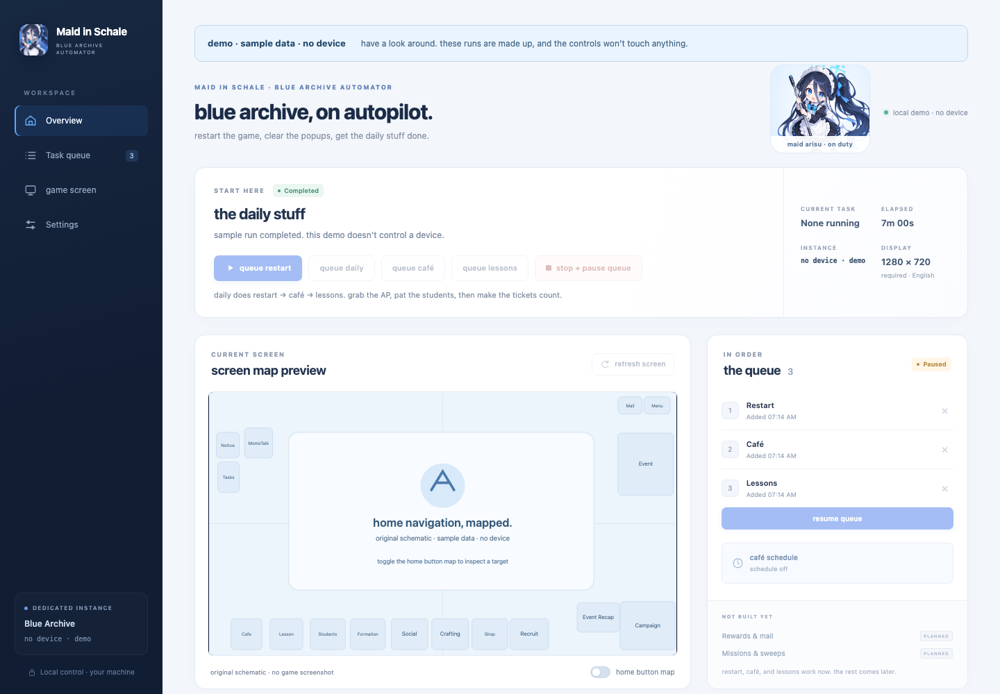

# maid in schale

*blue archive automator · maid arisu is on duty*

[](https://github.com/davidmwest/blue-archive-automator/actions/workflows/tests.yml)

blue archive has a lot of daily clicking. i'd like the computer to handle it, leave a useful record of what happened, and close the game when it's done.


this is a local Python automator built around BlueStacks, ADB, OpenCV, and local OCR. jobs go into one queue and run one at a time. [ALAS](https://github.com/LmeSzinc/AzurLaneAutoScript) is the model: recognize the screen, do one thing, check what happened. no LLM calls in the runtime.

**[high-level design](docs/design.md)** · [engineering notes](docs/engineering.md) · [setup](docs/getting-started.md) · [contributing](CONTRIBUTING.md)

## have a look



*sample data, an original game-screen schematic, and Maid Arisu fan art. this is the same dashboard frontend, with a separate read-only server behind it.*

arisu has a clipboard by the controls, tea when the queue is empty, and a pile of coins to sweep up by the loot box. [the fan art →](docs/mascot-art.md)

the demo needs Python 3.11+, but no packages, emulator, account, or local config. from the repo directory:

```sh
python3.11 -m ba_automator.demo
```

on Windows: `py -3.11 -m ba_automator.demo`. open [localhost:8766](http://127.0.0.1:8766), look through the queue, important actions, popup evidence, and home map. controls that would change anything are disabled. Ctrl+C stops it.

## what works

| piece | current behavior |
| --- | --- |
| restart | closes and relaunches the game, accepts required data downloads, dismisses startup popups, verifies a clear home screen; force-restarts once if startup times out |
| club | checks Social → Club once per game day, then collects the attendance mail |
| [Joint Firing Drill](docs/joint-firing-drill.md) | uses prepared Shooting Drill teams, proves all three in practice, clears once, then sweeps remaining tickets; supports one borrowed assistant |
| [total_assault](docs/total-assault.md) | configurable target, mock-tested assistant fallback, real clear, and remaining-ticket sweeps; Hardcore completed in staged live validation |
| assault_rewards | checks Rank Reward and Total Points Rewards, claims available loot, and leaves raid tickets alone |
| tactical_rewards | collects available time and daily rewards without spending battle tickets |
| tactical_battles | scouts opponents, climbs with the saved team, and keeps one ticket for manual play by default |
| red_dots | queues home and Campaign reward collectors when their red dots appear; follows up on excess AP |
| free_pack | claims the Free Daily Pack, verifies its receipt, then checks mail |
| cafe | restarts first, collects available AP and credits, scans both unlocked floors for relationship icons, optionally invites a student, returns home |
| tasks | checks the Tasks red dot, claims completed rewards and the daily bonus, saves item counts and receipts |
| loot gathered | game icons, exact tooltip names, grouped totals, itemized receipts, and relationship level-ups with stat gains; clearing keeps the history |
| [daily logs](docs/daily-logs.md) | the full day's text log beside important actions, saved as YYYY-MM-DD.log and kept across restarts |
| bounties and scrimmages | split tickets across three areas, rotate extras by weekday, sweep the highest three-star clears, save receipts |
| packs and mail | five optional paid packs, including Weekly AP Pack IV and Weekly Activity Report Pack (Lite), all off by default; collects mail and logs the rewards |
| crafting | uses the saved Quick Craft preset, fills affordable slots, and persists collection/refill timers; all three natural completions and the zero-keystone path passed |
| lessons | checks all schools once, picks rooms with the most owned students, and groups visits by school; optional lowest-school-rank strategy rechecks after each ticket |
| dashboard | one serial queue, do everything / pause / resume controls, tucked-away manual tasks, settings, a clickable game preview, and persistent important-action history |
| spend AP | configurable AP floor, highest-cleared commissions, and a persistent Hard-stage round robin with its own planning page |
| scheduling | regular red-dot/AP check-ins, optional daily routine after Global reset with saved occurrence state, hourly AP checks, daily pack checks, Cafe visits and per-slot crafting deadlines, optional game closure between visits |
| events | season-specific profiles, stories before quest farming, opt-in quest clearing, and a separate automatic treasure switch; see below for limits |

restart, a complete two-floor Cafe visit, a free invitation, and the relationship-focused Lessons routine have passed live on the development Mac. seven lesson tickets were tested with verified receipts; the final run reached zero tickets, returned home, and closed the game. offline tests run on macOS, Windows, and Ubuntu. actual school rank-up popups, live Windows operation, and running beside ALAS still need verification. a completed scan and a verified relationship increase are different results; the logs keep them separate.

cafe invitations are off by default. turn them on and leave the name blank to pick the highest relationship that still has room to grow, or give it an exact student name. it checks current rarity when a rank might be capped; it doesn't assume everybody is still at their original stars. only normal free invitations are supported. [setup and validation limits →](docs/getting-started.md#cafe-and-scheduling)

the daily routine covers startup, Club, free packs, mail, Cafe, Bounties, Scrimmages, Lessons, and Tasks. turn on the optional jobs for paid packs, Tactical Challenge battles, Total Assault, Joint Firing Drill, and event treasure. reward collectors check home and Campaign red dots. **Spend AP runs last**, as its own queue job, so collecting AP doesn't leave it sitting there until tomorrow.

paid packs need payment set up in Google Play. each pack is opt-in with a price limit; a payment failure disables automatic purchases and shows a notice. authentication can still need your help. [packs and mail →](docs/packs-and-mail.md)

turn on **run daily after reset** in settings to run that plan once per game day. it defaults to one minute after Global reset, with the next run shown in your local time in the queue. missed reset? it catches up on the current day when the server is back. if one activity fails, Daily logs it, gets back home, and carries on with the independent jobs when it can. uncertain spending stays on hold; the failed step isn't repeated. the final summary tells you what finished and what needs attention. keep the server running and the computer awake. [daily schedule →](docs/getting-started.md#daily-schedule)

between jobs, it checks red dots and AP every 30 minutes by default. change that interval or turn it off in settings. a successful check after another job resets the timer, so it doesn't wake the game just to look again. reward collection and AP spending use the same queue and your existing settings. [periodic check-ins →](docs/getting-started.md#periodic-check-ins)

most of the time, the controls are just **do everything** and **pause queue**. do everything resumes the queue, finishes anything already in progress, runs enabled jobs that are due, then checks for red dots and extra AP right away. it also checks Joint Firing Drill, Total Assault tickets, and remaining Tactical Challenge tickets above your reserve when their daily battle settings are enabled, even if today's Daily was already attempted. it keeps your AP floor and spending settings. when paused, **resume queue** picks up the existing work. individual jobs and the immediate stop button are under **manual controls**.

if there's something you actually need to do, it shows up under the controls with an explanation and a link to the screenshot trace. a missed animation frame shouldn't be your problem. ordinary recognition errors stay in the daily log and run history; resolved notices go away automatically. an uncertain purchase or resource transaction still puts spending on hold. dismissing its notice doesn't remove that hold.

want to click around yourself? hit **play here** above the game screen. it pauses the queue, waits for the current job to finish, and refreshes the picture every few seconds. the pointing hand means you can click: one click sends one finger-style tap to that spot in BlueStacks. clicking during a refresh saves your tap until the screenshot finishes. taps go straight to the game without checking whether the picture still matches, so animations won’t block them. give the next picture a moment to catch up. **done playing** leaves the queue paused; hit **resume queue** when you're ready. taps only for now, no dragging or typing.

tactical challenge gives each usable ticket its own 10-minute search window by default, adjustable in settings. it spends the first 37% setting a benchmark, then gradually relaxes toward the weakest quarter of teams it has seen. after ten minutes, it keeps searching and relaxes one observed score tier per unsuccessful refresh until an eligible opponent qualifies. the timer never consumes a ticket; the manual-play reserve stays available. [tactical settings →](docs/getting-started.md#tactical-challenge)

## run it locally

use the global English game in a dedicated BlueStacks instance. **2560×1440 landscape, 640 DPI** is the recommended setup; exact 16:9 resolutions from 1280×720 through 3840×2160 are supported. screenshots and text OCR use the native pixels. templates and coordinates keep their 1280×720 reference, and taps scale to the actual screen. 20 fps has worked well on the development Mac. sharper text and receipts cost more rendering, OCR time, and storage. 1440p has live startup, red-dot, two-floor Cafe, and Total Assault sweep evidence; 1080p and 2160p have offline coverage only. [validation details →](docs/engineering.md#evidence-and-its-limits)

sign in manually once. Blue Archive and Azur Lane get different ADB endpoints; they can share a compatible host ADB server. paid Google Play checkout requires its separately validated 720×1280 or 1440×2560 portrait layout. [setup and commands →](docs/getting-started.md)

## why it's built this way

- **check the result.** taps need a recognized screen and a fresh frame. downloads, popups, and camera movement get explicit verification and bounded retries.
- **measure the camera.** Cafe furniture is arbitrary, so room coverage follows observed motion and overlapping views. unknown movement never counts as a camera boundary.
- **look before spending.** the lessons job surveys schools before planning its visits and rechecks each selected room. AP jobs verify the stage, cost, and floor before confirming. the planning rules run without an emulator and have their own tests.
- **leave evidence.** important actions, before/after popup images, reward receipts, and failure reasons make a run inspectable afterward.
- **keep it local.** the real dashboard binds to loopback. the demo cannot reach a device. event rules are researched ahead of time and stored as data.

[the engineering notes](docs/engineering.md) walk through the missed-student bug and the camera fix. [the design](docs/design.md) sets the task contracts and build order; [the architecture](docs/architecture.md) describes the code that exists today.

## events get first dibs on AP

turn on **event farming** on the Spend AP page. while its farming policy is active, the order is **unfinished stories → event quests → regular AP farming**. everything keeps your AP floor. if it can't verify the event screen, it holds that AP instead of quietly spending it on Hard 13-2.

Aquatic Showdown is the first event adapter. stories are cleared once, with progress saved between visits; locked guest formations use the team the game provides, including partially filled teams. for quests, **yes, clear it** uses default Auto Formation, stops at the first result below three stars, the AP floor, or the end, then pauses the queue. repeat farming uses verified three-star clears and your configured stage order.

**do the treasure hunt automatically** is a separate switch. it spends saved event currency, follows exposed prizes, and otherwise picks a tile that covers the most possible hiding places. the round goal controls when event farming can hand AP back to the regular plan. uncertain spending stays on hold until its receipt is reconciled.

quest clearing, Quest 5/9 sweeps, story clears, and treasure digs have live evidence. that doesn't mean every event or every prize layout works: each event needs a reviewed profile and screen fixtures. event shops and automatic support for arbitrary new events are still future work. [event design and validation →](docs/event-farming.md)

## what's next

Final Restriction Release, the mode with Fury of Set, has a [design proposal](docs/final-restriction-release.md): seasonal progress, a saved ten-student team, and one floor attempt at a time so AP and cafe work can keep moving. it's a plan, not an implemented job yet.

more live coverage for school rank-ups, deeper invitation lists, crafting refills, and Windows. Joint Firing Drill still needs automatic team building and support beyond prepared Shooting Drill teams. the job docs distinguish live results from offline tests.

the queue is currently in memory. schedule state and important actions survive a server restart, but queued jobs don't. durable recovery, emulator lifecycle management, and service installation are later work. see [the roadmap](docs/roadmap.md) for the live evidence and remaining limits.

## license

original code, docs, and dashboard UI are [MIT licensed](LICENSE). use them, change them, build something with them. the Maid Arisu mascot is original fan artwork of a Blue Archive character; it, game recognition images, and test fixtures are outside that grant. [third-party notices](THIRD_PARTY_NOTICES.md) explain the boundary.
