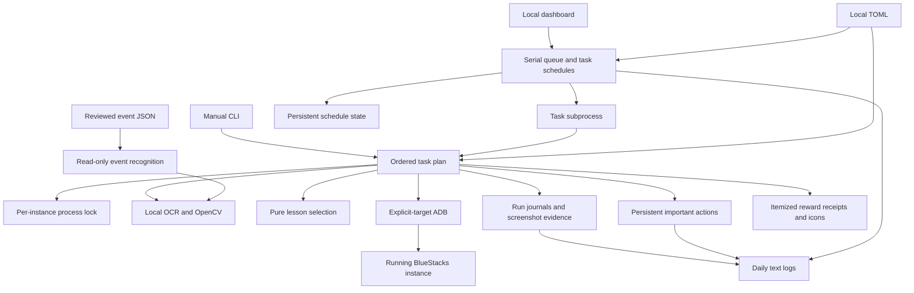

# Architecture

See [the high-level design](design.md) for the project direction and planned contracts. This document describes the implementation that exists today.

Status: the local dashboard dispatches restart, Cafe, Lessons, Club, reward collection, ticket sweeps, AP spending, and Crafting through one queue. Schedule state, important actions, loot receipts, and daily text logs persist locally. Live validation covers the main Mac routines, including an automatic free invitation; task guides distinguish verified paths from offline-only cases. Actual school rank-up handling and live Windows operation remain unverified. Development session: September 23–26, 2026.

## Runtime

The Python 3.11+ core controls one explicit ADB endpoint. The initial profile is global English Blue Archive (`com.nexon.bluearchive`) at 1280×720 landscape and 320 DPI, running in BlueStacks Air on Apple Silicon macOS. BlueStacks 5 on Windows is the portability target; its live smoke test remains outstanding. The emulator instance must already be running.

`restart` force-stops and launches Blue Archive, reuses its existing session, handles recognized startup states, and verifies a clear home screen. `tasks.py` owns the ordered plans. `daily` runs restart → Club → free pack → optional paid packs → mail → Cafe → Bounties → Scrimmages → optional Tactical Challenge battles → Tactical Challenge rewards → Lessons → optional Total Assault → Total Assault rewards → optional Spend AP → Tasks rewards. Bounties, Scrimmages, Tactical Challenge battles, and Lessons have individual daily-inclusion settings; Total Assault, paid packs, and automatic AP spending are off by default. After an isolated task failure, Daily attempts bounded recovery to home and continues independent steps. A stop request or failed recovery ends the plan; unresolved spending remains held for the affected task.

`cafe` runs restart → Club → mail → Cafe, followed by Spend AP when enabled; `lessons` runs restart → Lessons. All successful task plans finish with a home-notification scan. The dashboard turns recognized red dots and eligible excess AP into serial follow-up jobs. Standalone Club and free-pack jobs collect mail after their own actions.

`serve` provides a loopback dashboard at `127.0.0.1:8765`. It dispatches the same CLI tasks through a serial queue, with periodic check-ins and optional Daily, Cafe, Crafting, AP, and paid-pack schedules. There is no installed operating-system service, emulator start/stop manager, or cloud inference dependency.

## Components

| Module | Responsibility |
| --- | --- |
| `cli.py`, `tasks.py` | Diagnostics, supported job plans, sequential dispatch, local server, and interruption handling |
| `config.py` | Validate the explicit loopback endpoint, timing and task settings, spending preferences, and storage paths |
| `adb.py` | Shared-server compatibility, targeted connection, package and foreground checks, force-stop/launch, screenshots, taps, and swipes |
| `vision.py` | Fixed-size frame decoding, local RapidOCR/ONNX inference, startup classification, templates, and conservative overlay recognition |
| `restart.py` | Bounded startup loop, fresh-frame input, popup evidence, and stable-home verification |
| `club.py` | Badge-gated attendance, verified Club entry, and per-instance checkpointing at the 19:00 UTC game-day boundary |
| `cafe.py`, `cafe_vision.py` | Earnings receipts, unlocked floor navigation, attention-marker scans, relationship feedback, and optional free invitations |
| `invitations.py`, `invitation_picker.py`, `invitation_roster.py` | Pure invitation ranking, guarded list navigation, and exact-student current-rarity lookup |
| `lessons.py`, `lesson_vision.py` | Complete location surveys, rank/XP and room observations, guarded one-ticket confirmation, and result reconciliation |
| `crafting.py`, `crafting_vision.py`, `crafting_state.py` | Saved-preset Quick Craft, guarded batch spending, reward reconciliation, and per-instance durable slot deadlines |
| `spend_ap.py`, `ap_vision.py`, `ap_policy.py`, `ap_state.py` | Three-star stage surveys, AP-floor budgeting, commission sweeps, durable Hard-stage rotation, and pending spend reconciliation |
| `tickets.py`, `ticket_vision.py`, `ticket_state.py` | Bounty/Scrimmage stage surveys, weekday ticket allocation, guarded sweeps, and durable completion counts |
| `packs.py`, `packs_state.py`, `mail.py`, `shop_runtime.py`, `shop_vision.py` | Opt-in paid-pack policy, durable purchase holds, verified mail collection, and shared shop navigation |
| `free_pack.py`, `task_rewards.py`, `task_rewards_vision.py`, `tactical_rewards.py` | Guarded collection of free packs, completed Tasks, and Tactical Challenge rewards without spending battle tickets |
| `tactical_battles.py`, `tactical_runtime.py`, `tactical_refresh.py`, `tactical_vision.py`, `tactical_formation.py` | Opponent scouting and conditional sampling estimates, team-level policy, saved-team completion, guarded battle entry, and ticket reserve |
| `tactical_state.py`, `tactical_survey.py` | Durable opponent history and battle intents, plus separate expiring survey checkpoints that let long searches yield the queue |
| `home_badges.py`, `red_dots.py` | Home notification recognition and duplicate-suppressed follow-up requests, including excess AP |
| `checkin_schedule.py` | Per-instance periodic check-in deadlines, validation, and atomic state persistence |
| `lesson_planner.py` | Pure relationship and school-rank policy over observed locations, rooms, ownership, and relationship ranks |
| `runtime.py` | Shared fresh-capture contract, task result/error, screenshot ring, and durable run journal |
| `events.py` | Strict event-profile validation and read-only entrance/destination matching; no event task |
| `server.py`, `web/` | Loopback dashboard, serial subprocess queue, schedule, settings, evidence views, and visual home map |
| `actions.py` | Durable JSONL history of important attempts and confirmed outcomes |
| `loot_receipts.py`, `loot.py` | Local item-tooltip inspection, quantity and icon evidence, receipt deduplication, grouped totals, and clear-cursor accounting |
| `daily_log.py` | Process-safe text logs by local calendar date, runtime/action aggregation, and idempotent historical imports |
| `locking.py` | OS process lock scoped to the endpoint and game package |

Device and vision interfaces are injectable for offline tests. `inspect --image` classifies a saved screenshot without device configuration or an emulator connection.

## Startup recognition

The runner acquires the instance lock, verifies the selected game and display, force-stops the game, resolves its launcher, and starts it. It then captures a fresh frame, confirms the foreground package, recognizes the state, performs at most one action, and checks the next frame.

Blocked states and startup overlays take priority over home recognition. Bare Yes/OK/Confirm text is insufficient to authorize a tap. A data-download prompt needs download context and an affirmative control. Store binary updates, external sign-in, passwords, 2FA, and maintenance require attention; credentials are not managed by the runner.

Known notice handlers run first. A generic X-close fallback requires matching dimmed home anchors, a plausible bright modal, and one unambiguous geometric X near its upper-right corner. Shading alone is insufficient. Sensitive dialog text and ambiguous close candidates suppress the fallback. This intentionally supports a limited class of overlays, not every popup shape.

Both fixed home anchors must match with color agreement. Success requires repeated clear-home observations spanning at least five seconds; a dimmed home screen behind a modal does not qualify. Popup actions retain a before frame, the following frame, detector name, and observed result in the journal. These records distinguish a dismissal attempt from a changed or unchanged screen.

Default timing is a 1.5-second poll, three-second tap cooldown, 300-second startup budget, and a separate 1,800-second download window. Later download prompts do not reset that deadline. A startup timeout saves the last frame, force-stops and relaunches the selected game once, and gives startup one fresh 300-second budget. The same instance lock and journal cover both attempts. The original download deadline and 40-tap limit carry across the retry. A second startup timeout stops the job; download, unknown-screen, authentication, and transport failures do not trigger this retry. Recovery attempts and their outcomes appear in important actions. Unknown screens time out after 60 seconds. Additional limits bound the full run, repeated identical actions, and total taps. Frames older than five seconds are not acted upon.

## Club attendance

Club runs immediately after restart in Daily and Cafe plans and can be queued independently. The home Social badge and the Club card's own notification must both authorize entry. A verified Club page saves a per-instance game-day checkpoint; the attendance notice records that 10 AP was sent to mail, while the later Mail receipt establishes what was actually received. A visit without that notice records a check rather than a reward. The September 24 live test verified attendance, its 10 AP mail receipt, and return home. Same-day suppression and failure-before-checkpoint cases have offline coverage. See [Club](club.md).

## Cafe routine

After restart, cafe enters from verified home, collects available AP and credits first, and verifies the Reward Acquired receipt. It scans both unlocked floors, requiring the English switch label before and after each transition. Optional configured free invitations are checked after both required scans; one successful invitation triggers another scan for that student and ends the invitation check. The task then returns to verified home. See [cafe behavior](cafe.md) for cooldowns and validation limits.

Student detection uses local yellow attention-marker templates, fresh frames, settling waits, and bounded slow camera pans through overlapping views. A successful tap is recorded separately from relationship-heart feedback. Missing markers can mean cooldown, occlusion, or a student outside the current view; they do not prove every student was petted. The runner has a 15-minute limit and bounded camera, marker, and invitation-list scans.

Camera coverage uses short 1,800 ms drags followed by local feature matching to measure scene displacement. The runner accumulates movement toward overlapping views and verifies a boundary through two independently observed stationary drags. When animation obscures motion evidence, it checks students in that intermediate view and resets the distance and boundary evidence before moving again. Unmeasurable motion never counts as a boundary. It traverses alternating rows with limits on drags, rows, columns, and total time, checking partial edge views too. The approach does not require a furniture template or zoom gesture. Both floors passed a full live run; another player's layout passed a separate camera-movement check.

Invitations are off by default. An exact configured name selects its matching row; a blank name uses the highest uncapped relationship policy. `invitations.py` separates row observations and rank/cap policy from input. `invitation_picker.py` verifies an empty search field, descending order, list boundaries, overlapping scroll observations, and a fresh selected row. At boundary ranks 10, 20, or 30, `invitation_roster.py` reads the exact student's current profile stars before the picker returns to the original Cafe and reselects; rank 100 is skipped. Uncertain identity, rarity, or comparison data stops selection. The [Cafe guide](cafe.md#free-invitations) records current caps and configuration.

Both selection paths require an exact-name normal invitation confirmation and a new cooldown before recording success. A cooldown skips the action; bonus invitations are unsupported. The blank-name free invitation passed live, including confirmation, cooldown, action/daily-log evidence, and return home. Current-star lookup passed separately. The combined boundary-rank lookup and reselection, deep scrolling, and configured-name full path retain offline coverage only. No bulk relationship-collection control has been verified; the Gift panel's portrait shortcut is for gifting.

## Lessons routine

Lessons begins at verified home, reads the ticket counter, and cycles through unlocked locations. It records rank and XP, inspects available room cards and ownership/relationship indicators, and checks that the surveyed ranks add up to the game's Total Area Rank. A configured location allowlist limits eligible rooms; unknown names or incomplete coverage stop the run. The runner repeats the survey before each ticket instead of assuming previous rank, room, or student observations remain valid.

The pure planner defaults to the most owned students, then the highest sum of their relationship ranks. The alternate school-rank strategy chooses the lowest rank and fractional XP progress, then the most total students and highest owned relationship-rank sum. Stable identity resolves equal scores. It excludes completed rooms and distinguishes missing evidence from zero. If every eligible school is capped, the school-rank strategy falls back to relationship selection.

Before spending, the runner reopens the selected room and checks its confirmation against the chosen observation. One ticket is confirmed at a time. Completion needs result evidence and the expected ticket decrement, with the location, room, strategy, counts, and readable rank/XP changes recorded in important actions. Ticket limits restrict existing tickets; there is no purchase path. See [Lessons](lessons.md) for the full policy, failure behavior, and current live-validation status.

## Total Assault

`total_assault` is an optional Daily step or standalone restart → raid → home task. The configured difficulty is the ceiling for any required unlock ladder. Auto formation must pass a mock battle with a configured time margin; a fallback assistant replaces the least-damage striker, matches its selected attack type, and must pass a second mock. Only the verified team can enter for real. Remaining tickets may be swept after a verified target clear and observed sweep availability. Failures require player review instead of blind ticket retries. See [Total Assault](total-assault.md) for the policy and validation limits.

## Tasks rewards

`tasks` runs restart → Tasks collection → home. It checks the fixed home notification badge, selects All, collects enabled Claim All and daily completion rewards, and rechecks for rewards unlocked by collection. Only a recognized receipt authorizes a received-reward log. The shared receipt reader retains overlapping panels and merges repeated cards without counting them again. Daily ends with this collection and a notification scan; eligible excess AP can request an immediate Spend AP follow-up. See [Tasks rewards](task-rewards.md) and [red-dot dispatch](red-dots.md).

## Crafting

`crafting` runs restart → Crafting → home. It checks all three synthesis slots, collects ready items with receipt verification, and refills empty slots from the existing keystone-only Quick Craft preset. Its atomic per-instance state records deadlines and pending irreversible actions. Setup problems disable further automatic visits; observed empty inventory schedules a later recheck. See [Crafting](crafting.md) for spending limits and live-validation status.

Batch selection starts at one and increases within observed inventory and credit costs. It does not use the game's Max control, which can select an unaffordable quantity. Live validation covers all three natural completions, zero-keystone visits, and a subsequent two-keystone/4,000-credit batch with two verified timers. Collection immediately followed by refill in the same visit remains covered offline.

## Loot and daily logs

`loot_receipts.py` inspects each reward card before dismissal, reading the tooltip name and the received quantity separately. Sweep totals come from Final Rewards Earned or its expanded Full List; Owned counts and duplicate per-sweep rows are excluded. Saved icons and receipt sidecars feed `loot.py`, which groups matching items, sorts categories by importance, and deduplicates receipt/completion records. Clearing totals preserves their history. Partial receipts distinguish unread item details, an unverified full list, and missing details instead of presenting all three as unidentified drops. See [Loot Gathered](loot.md) for the live layouts and remaining limits.

`daily_log.py` combines queue events, task diagnostics, important actions, resource outcomes, and evidence references into `YYYY-MM-DD.log` files using the computer's local date. The Important Actions header links to today's plain-text log; date-based endpoints expose archives without accepting file paths. Process-safe appends preserve complete lines across dashboard and CLI workers. Historical imports are idempotent, and reconstructed older timestamps are marked as estimated. Raw OCR, credentials, and payment-method details stay out of this text view. See [daily logs](daily-logs.md).

## Dashboard and schedule

The dashboard binds to loopback and launches one task subprocess at a time. Each job gets a configuration snapshot and its own diagnostic directory. The same per-instance lock also protects against a separately launched CLI runner.

Pause allows the current job to finish and blocks dispatch. Stop interrupts the current job and pauses the queue. The explicit pause/resume choice survives daemon restarts; shutdown itself does not change that choice. Resume permits queued work and clears the scheduler's retry pause. Waiting jobs can be canceled. Settings cannot be changed while jobs are active or queued.

Periodic check-ins default to every 30 minutes under `[checkin]`, with a configurable interval of 5–1440 minutes or an off switch. A due visit uses the existing `red_dots` plan: restart the game on the running emulator, scan Home and Campaign, and queue eligible reward/AP follow-ups. A successful final scan from another job also restarts the interval. The per-instance deadline persists before dispatch; downtime produces at most one overdue visit, while failed or interrupted checks wait another interval. Check-ins respect the serial queue, pause, task eligibility, and spending holds. Invalid timer state holds only check-ins and appears in the queue schedule summary. Host and emulator startup remain manual.

Crafting scheduling is separately enabled and off by default. The dispatcher reads durable slot deadlines and combines currently due slots into one queued Crafting visit. It reconstructs overdue work after restart; failed runs back off 15 minutes and pause after three failures. Setup disables remain separate from retry pauses.

Cafe scheduling is explicitly enabled and off by default. A successful cafe job or verified Cafe step within daily records the next due time three hours and 15 seconds later. A later Lessons failure or interruption does not undo the completed Cafe visit. A Cafe failure sets a 15-minute retry; three consecutive failures pause retries until Resume. Pending cafe/daily work prevents a duplicate scheduled cafe job. Canceling a scheduled occurrence skips that occurrence instead of immediately recreating it.

The Cafe timer enqueues `cafe`, so recurring visits check Club and mail and may spend excess AP when enabled, but do not spend lesson tickets. Lessons can be queued directly or included in the full Daily plan. Separate opt-in schedules check AP hourly and permanent paid-pack ownership once per game day; unresolved spending or payment holds block automatic retries.

Daily scheduling is opt-in under `[daily]`. `daily_schedule.py` determines the Global game day from the fixed 19:00 UTC reset, with a configurable delay of 0–120 minutes (default one). The dashboard queues only the current game day's occurrence after its deadline, including after downtime. Before dispatch, it saves an instance-scoped occurrence; completion, failure, or interruption prevents automatic same-day replay. Manual dashboard Daily runs also record an occurrence and can explicitly retry reviewed failures. Cancelling an automatically queued Daily records that day as skipped. Queue pause and serial dispatch still apply; this is scheduling persistence, not per-step Daily resumption.

Cafe/Crafting retry state and the queue's pause choice persist in `data/state/schedule.json`; task-specific files retain craft deadlines and AP/pack check times. Failed-job notices persist separately and can be dismissed without deleting their diagnostic history or clearing a spending hold. The FIFO job queue and dashboard's recent job list are in memory and disappear at shutdown. `serve` must remain running for schedules to execute; no system service or login item is installed.

`[automation] close_app_when_idle` is optional and defaults to false. Once the final dashboard task subprocess has exited, the controller checks for due/queued work and, if the queue is empty, force-stops the configured game under the instance lock. It performs this once after a job, including a failed or interrupted final job; it is not a recurring idle timer. BlueStacks and the dashboard remain open. Standalone CLI runs are unaffected, and closure does not change the task result. The important-action history records successful app closure.

## Storage and evidence

Storage paths are relative to the TOML file. With the example configuration:

| Location | Contents |
| --- | --- |
| `data/runs/` | Per-run durable `events.jsonl`, a 24-frame screenshot ring, and retained completion/evidence images |
| `data/runs/dashboard-*/` | Dashboard job snapshots and the subprocess's run directories |
| `data/state/important-actions.jsonl` | Persistent important actions, including separate attempts and verified results |
| `data/state/logs/YYYY-MM-DD.log` | Full daily text log with local timestamps, task diagnostics, actions, and queue events |
| `data/state/schedule.json` | Queue pause choice, Cafe due time, and Cafe/Crafting failure counts, retry pauses, and backoff |
| `data/state/daily-<instance hash>.json` | Latest Daily game-day occurrence, run identity, timestamps, and outcome |
| `data/state/checkin-<instance hash>.json` | Next periodic check-in deadline, visit timestamps, and last result |
| `data/state/crafting-<instance hash>.json` | Craft slot deadlines, inventory recheck time, setup-disable reason, and pending action |
| `data/state/club-<instance hash>.json` | Verified Club attendance check for the current game day |
| `data/state/ap-<instance hash>.json` | Stage catalog, Hard-stage rotation, spending hold, and next AP check |
| `data/state/bounties-<instance hash>.json`, `scrimmages-<instance hash>.json` | Game-day ticket allocation, verified progress, and pending sweep |
| `data/state/tactical-<instance hash>.json` | Game-day opponent history, verified identities, ticket/rank observations, and unresolved battle intent |
| `data/state/tactical-survey-<instance hash>.json` | Disposable scouting samples, candidate identities, lookup progress, and continuation deadline; expires after four hours or a game-day, rank, or scouting-setting change |
| `data/state/packs-<instance hash>.json` | Pack ownership observations, purchase intent, payment hold, and next check |
| `data/state/failed-jobs-<instance hash>.json` | Persistent, dismissible failed-job notices |
| `data/state/loot-icons/`, receipt-adjacent `.loot.json` files | Saved game icons and itemized receipt metadata |
| `data/locks/` | Shared per-instance process locks |

Ctrl+C and task failure record the result and release the lock. The `restart` task starts a new force-stop/launch sequence; startup itself has no resume checkpoint. Cafe receipts and relationship evidence, plus lesson survey and receipt evidence, are retained separately from the rotating screenshot ring.

JSONL remains the machine-readable history format, supplemented by daily text logs and atomic task state. Crafting, AP, tickets, Club, paid packs, and Tactical Challenge have task-specific durable checkpoints or intents; a general resumable queue and SQLite history are deferred. Tactical survey continuations append behind ordinary scheduled work, and discarding survey progress never clears unresolved battle intent. Local config, raw screenshots, and logs remain outside Git. Only reviewed recognition crops and sanitized fixtures belong in the repository.

## Resource use and coexistence

All coordinates refer to the 1280×720 ADB screenshot; host window size and Retina scaling do not change them. The runner rejects other pixel dimensions. Keep 320 DPI and the English layout consistent with the assets; pixel size is validated, density is a setup requirement.

OCR uses CPU inference with two worker threads and one inter-operation thread; OpenCV uses two threads. Recognition is deterministic and local. Event research happens ahead of time and becomes reviewed JSON rules. Optional future AI assistance is not active in the runtime.

BlueStacks CPU/RAM allocation, FPS, and graphics settings remain the resource controls. The idle server does not run continuous game recognition. Resource presets still need measurements on both platforms.

Blue Archive uses `127.0.0.1:5695`; Azur Lane uses `127.0.0.1:5675`. Both may share the host ADB server on `5037`, with explicit serials on game commands. The transport checks server/client protocol compatibility and stops on a mismatch rather than killing the shared server. Use the same compatible ADB executable and separate configs, logs, and instance locks. Processes controlling the same Blue Archive instance must share its lock directory. Live simultaneous operation with ALAS remains unverified. [Android's ADB guide](https://developer.android.com/tools/adb) describes this server and explicit-device model.

[ALAS](https://github.com/LmeSzinc/AzurLaneAutoScript), [ArisuAutoSweeper](https://github.com/TheFunny/ArisuAutoSweeper), and [BAAS](https://github.com/pur1fying/blue_archive_auto_script) informed the architecture and recognized cases. This implementation is original; their source and assets are not imported.
