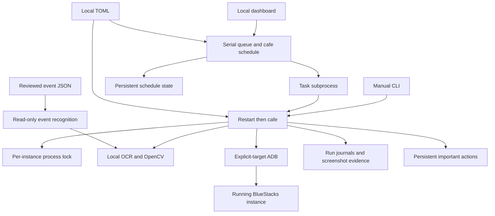

# Architecture

See [the high-level design](design.md) for the project direction and planned contracts. This document describes the implementation that exists today.

Status: restart and a complete two-floor Cafe visit verified live; local dashboard, scheduling, idle-close, and event-profile recognition implemented. Optional invitation completion remains unverified live. Development session: September 23–24, 2026.

## Runtime

The Python 3.11+ core controls one explicit ADB endpoint. The initial profile is global English Blue Archive (`com.nexon.bluearchive`) at 1280×720 landscape and 320 DPI, running in BlueStacks Air on Apple Silicon macOS. BlueStacks 5 on Windows is the portability target; its live smoke test remains outstanding. The emulator instance must already be running.

`restart` force-stops and launches Blue Archive, reuses its existing session, handles recognized startup states, and verifies a clear home screen. `cafe` and `daily` both run `restart` followed by the cafe routine. Failure stops the sequence.

`serve` provides a loopback dashboard at `127.0.0.1:8765`. It dispatches the same CLI tasks through a serial queue, with an optional cafe schedule. There is no installed operating-system service, emulator start/stop manager, or cloud inference dependency.

## Components

| Module | Responsibility |
| --- | --- |
| `cli.py` | Diagnostics, restart/cafe/daily task sequencing, local server, and interruption handling |
| `config.py` | Validate the explicit loopback endpoint, timing settings, cafe preferences, and storage paths |
| `adb.py` | Shared-server compatibility, targeted connection, package and foreground checks, force-stop/launch, screenshots, taps, and swipes |
| `vision.py` | Fixed-size frame decoding, local RapidOCR/ONNX inference, startup classification, templates, and conservative overlay recognition |
| `restart.py` | Bounded startup loop, fresh-frame input, popup evidence, and stable-home verification |
| `cafe.py`, `cafe_vision.py` | Earnings receipts, unlocked floor navigation, attention-marker scans, relationship feedback, and optional free invitations |
| `events.py` | Strict event-profile validation and read-only entrance/destination matching; no event task |
| `server.py`, `web/` | Loopback dashboard, serial subprocess queue, schedule, settings, evidence views, and visual home map |
| `actions.py` | Durable JSONL history of important attempts and confirmed outcomes |
| `locking.py` | OS process lock scoped to the endpoint and game package |

Device and vision interfaces are injectable for offline tests. `inspect --image` classifies a saved screenshot without device configuration or an emulator connection.

## Startup recognition

The runner acquires the instance lock, verifies the selected game and display, force-stops the game, resolves its launcher, and starts it. It then captures a fresh frame, confirms the foreground package, recognizes the state, performs at most one action, and checks the next frame.

Blocked states and startup overlays take priority over home recognition. Bare Yes/OK/Confirm text is insufficient to authorize a tap. A data-download prompt needs download context and an affirmative control. Store binary updates, external sign-in, passwords, 2FA, and maintenance require attention; credentials are not managed by the runner.

Known notice handlers run first. A generic X-close fallback requires matching dimmed home anchors, a plausible bright modal, and one unambiguous geometric X near its upper-right corner. Shading alone is insufficient. Sensitive dialog text and ambiguous close candidates suppress the fallback. This intentionally supports a limited class of overlays, not every popup shape.

Both fixed home anchors must match with color agreement. Success requires repeated clear-home observations spanning at least five seconds; a dimmed home screen behind a modal does not qualify. Popup actions retain a before frame, the following frame, detector name, and observed result in the journal. These records distinguish a dismissal attempt from a changed or unchanged screen.

Default timing is a 1.5-second poll, three-second tap cooldown, 300-second startup budget, and a separate 1,800-second download window. Later download prompts do not reset that deadline. Unknown screens time out after 60 seconds. Additional limits bound the full run, repeated identical actions, and total taps. Frames older than five seconds are not acted upon.

## Cafe routine

After restart, cafe enters from verified home, collects available AP and credits first, and verifies the Reward Acquired receipt. It scans both unlocked floors, requiring the English switch label before and after each transition. Optional configured free invitations are checked after both required scans; one successful invitation triggers another scan for that student and ends the invitation check. The task then returns to verified home. See [cafe behavior](cafe.md) for cooldowns and validation limits.

Student detection uses local yellow attention-marker templates, fresh frames, settling waits, and bounded slow camera pans through overlapping views. A successful tap is recorded separately from relationship-heart feedback. Missing markers can mean cooldown, occlusion, or a student outside the current view; they do not prove every student was petted. The runner has a 15-minute limit and bounded camera, marker, and invitation-list scans.

Camera coverage uses short 1,800 ms drags followed by local feature matching to measure scene displacement. The runner accumulates movement toward overlapping views and verifies a boundary through two independently observed stationary drags. When animation obscures motion evidence, it checks students in that intermediate view and resets the distance and boundary evidence before moving again. Unmeasurable motion never counts as a boundary. It traverses alternating rows with limits on drags, rows, columns, and total time, checking partial edge views too. The approach does not require a furniture template or zoom gesture. Both floors passed a full live run; another player's layout passed a separate camera-movement check.

The invitation handler matches an exact name to its row's Invite control, handles wrapped variants, scrolls inside the list, and guards the confirmation. A cooldown skips the action; a recognized cooldown notice is dismissed. New cooldown evidence is required before recording a successful invitation. The current account's active cooldown has prevented a complete live invitation test. No bulk relationship-collection control has been verified; the Gift panel's portrait shortcut is for gifting.

## Dashboard and schedule

The dashboard binds to loopback and launches one task subprocess at a time. Each job gets a configuration snapshot and its own diagnostic directory. The same per-instance lock also protects against a separately launched CLI runner.

Pause allows the current job to finish and blocks dispatch. Stop interrupts the current job and pauses the queue. Resume permits queued work and clears the scheduler's retry pause. Waiting jobs can be canceled. Settings cannot be changed while jobs are active or queued.

Cafe scheduling is explicitly enabled and off by default. A successful cafe/daily job records the next due time three hours and 15 seconds later. A failed job sets a 15-minute retry; three consecutive failures pause retries until Resume. Pending cafe/daily work prevents a duplicate scheduled cafe job. Canceling a scheduled occurrence skips that occurrence instead of immediately recreating it.

Schedule state persists in `data/state/schedule.json`. The FIFO job queue and dashboard's recent job list are in memory and disappear at shutdown. `serve` must remain running for schedules to execute; no system service or login item is installed.

`[automation] close_app_when_idle` is optional and defaults to false. Once the final dashboard task subprocess has exited, the controller checks for due/queued work and, if the queue is empty, force-stops the configured game under the instance lock. It performs this once after a job, including a failed or interrupted final job; it is not a recurring idle timer. BlueStacks and the dashboard remain open. Standalone CLI runs are unaffected, and closure does not change the task result. The important-action history records successful app closure.

## Storage and evidence

Storage paths are relative to the TOML file. With the example configuration:

| Location | Contents |
| --- | --- |
| `data/runs/` | Per-run durable `events.jsonl`, a 24-frame screenshot ring, and retained completion/evidence images |
| `data/runs/dashboard-*/` | Dashboard job snapshots and the subprocess's run directories |
| `data/state/important-actions.jsonl` | Persistent important actions, including separate attempts and verified results |
| `data/state/schedule.json` | Cafe due time, last success, failure count, and retry pause |
| `data/locks/` | Shared per-instance process locks |

Ctrl+C and task failure record the result and release the lock. A restart starts a new force-stop/launch sequence; there is no resume checkpoint. Cafe receipts and relationship evidence are retained separately from the rotating screenshot ring.

JSONL is the current history format; SQLite and resumable task checkpoints are deferred. Local config, raw screenshots, and logs remain outside Git. Only reviewed recognition crops and sanitized fixtures belong in the repository.

## Resource use and coexistence

All coordinates refer to the 1280×720 ADB screenshot; host window size and Retina scaling do not change them. The runner rejects other pixel dimensions. Keep 320 DPI and the English layout consistent with the assets; pixel size is validated, density is a setup requirement.

OCR uses CPU inference with two worker threads and one inter-operation thread; OpenCV uses two threads. Recognition is deterministic and local. Event research happens ahead of time and becomes reviewed JSON rules. Optional future AI assistance is not active in the runtime.

BlueStacks CPU/RAM allocation, FPS, and graphics settings remain the resource controls. The idle server does not run continuous game recognition. Resource presets still need measurements on both platforms.

Blue Archive uses `127.0.0.1:5695`; Azur Lane uses `127.0.0.1:5675`. Both may share the host ADB server on `5037`, with explicit serials on game commands. The transport checks server/client protocol compatibility and stops on a mismatch rather than killing the shared server. Use the same compatible ADB executable and separate configs, logs, and instance locks. Processes controlling the same Blue Archive instance must share its lock directory. Live simultaneous operation with ALAS remains unverified. [Android's ADB guide](https://developer.android.com/tools/adb) describes this server and explicit-device model.

[ALAS](https://github.com/LmeSzinc/AzurLaneAutoScript), [ArisuAutoSweeper](https://github.com/TheFunny/ArisuAutoSweeper), and [BAAS](https://github.com/pur1fying/blue_archive_auto_script) informed the architecture and recognized cases. This implementation is original; their source and assets are not imported.
