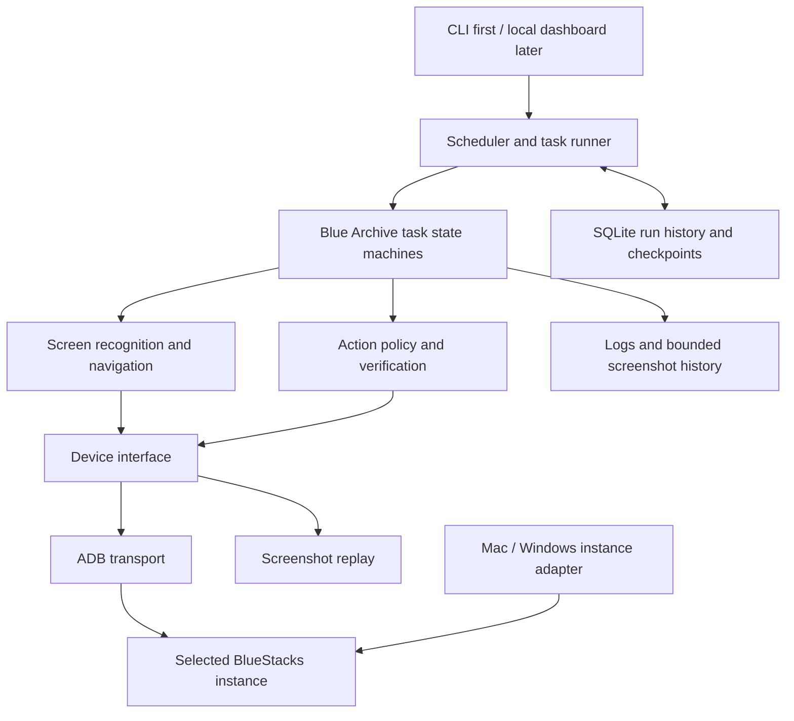

# Architecture

Status: initial design, 2026-09-23. No runtime has been implemented.

## Decision

Use BlueStacks Air on Apple Silicon macOS and BlueStacks 5 on Windows. Build a portable Python automation core around standard ADB. Use ALAS as a design reference, with Blue Archive task logic implemented independently.

The portability boundary is ADB plus a small emulator-management interface. BlueStacks Air and BlueStacks 5 have different host integrations; choosing the same vendor does not make instance discovery, launch commands, installation, or resource settings identical.

## Components

| Layer | Responsibility |
| --- | --- |
| Host adapter | Discover and select an instance, resolve its ADB endpoint, inspect supported resource settings, and eventually start/stop that instance. Separate macOS and Windows implementations. |
| Device | Capture frames, tap, swipe, send key events, and inspect/control the game process through an explicit ADB serial. Expose timeouts and connection failures through a stable interface. |
| Perception | Normalize the game viewport, match templates, identify pages and popups, and OCR small regions for counters or labels. Return evidence, confidence, and the frame timestamp. |
| Navigation | Maintain a graph of recognized pages and verified transitions. Account for popups and loading states without assuming every screen has a working Back button. |
| Tasks | Small state machines for individual chores. Each declares prerequisites, allowed actions, completion evidence, resource limits, and recovery behavior. |
| Action policy | Check the selected target, current screen, frame freshness, execution mode, and task budget before input. Verify the result after input. |
| Runner | Run one task at a time per instance, coordinate dependencies, enforce deadlines, and schedule work using the selected game server's reset rules. |
| Storage and diagnostics | Save run status, checkpoints, task outcomes, timings, and bounded local failure traces. Support replay tests without a live emulator. |

These are modules in one local application, not separately deployed services.

## Running alongside Azur Lane

Simultaneous operation with the existing Azur Lane daemon is a core requirement. Each daemon owns a different emulator instance and uses that instance's ADB endpoint explicitly for every device operation.

For the current development setup, Azur Lane is connected at `127.0.0.1:5675` and Blue Archive is configured at `127.0.0.1:5695`. These are device endpoints, distinct from the host ADB server's usual port `5037`. Both clients can share that server. Keep endpoint values in ignored local configuration and rediscover them when instances change; never assume these port numbers on another machine. Android documents the shared server and explicit target selection in its [ADB guide](https://developer.android.com/tools/adb).

Keep each daemon's configuration, task state, locks, logs, and eventual dashboard port separate. Instance/account locks are scoped to the corresponding game and profile, so Blue Archive does not block Azur Lane. Recovery must affect only the selected instance: no global `adb kill-server`, `adb disconnect` without a serial, broad process termination, or restart-all operation. On a shared-server problem, report it and pause rather than resetting the other daemon's connection.

Where configurable, use the same compatible Platform Tools ADB version in both daemons. Different client/server versions can disrupt a shared server; inspect the existing ALAS setup before wiring in automatic connection recovery. Separate ADB servers are a fallback if an existing client's behavior requires isolation, not a requirement just to use different devices.

Budget emulator CPU/RAM/FPS and recognition workers across both processes. Add a coexistence check that runs Blue Archive captures while ALAS remains active and confirms neither connection is interrupted. Concurrent operation is designed for, but has not yet been tested locally.

## Stack and interfaces

- Modern Python, with the exact supported version selected when the macOS ARM64 and Windows dependency smoke tests pass.
- OpenCV and NumPy for deterministic image matching and viewport transforms.
- A replaceable OCR provider selected against real English/Japanese/etc. screenshots for the chosen game client. Avoid committing to a large OCR stack before that check.
- Android Platform Tools ADB for the first transport. Invoke commands using argument arrays, explicit device serials, and bounded timeouts.
- Validated configuration for device selection, server, language, enabled tasks, budgets, and scheduling. Keep machine-specific configuration outside Git.
- SQLite for local run history and task checkpoints. Begin with a CLI; add a browser dashboard bound to localhost later, using the same runner API.

Start capture with `adb -s <serial> exec-out screencap -p` and input with standard ADB shell input commands. Benchmark capture latency and reliability before adding a streaming capture or persistent input helper. Android documents the screenshot transport in its [ADB guide](https://developer.android.com/tools/adb).

## Recognition and execution loop

1. Capture a fresh frame from the explicitly selected device.
2. Verify the expected app, viewport, page, and popup state.
3. Choose one action whose preconditions and budget are satisfied.
4. Send the action once.
5. Wait for observable progress, with a deadline and adaptive capture interval.
6. Record the observed outcome and continue, recover, or stop for inspection.

Use 1280×720 landscape as the initial reference resolution. Detect the actual viewport and map coordinates through an explicit transform; unsupported aspect ratios or layouts stop recognition rather than silently stretching the screen. Treat game region, language, UI scale, and client version as part of the asset profile.

Template matching handles stable icons and buttons. OCR handles changing values in cropped regions. Multiple anchors should identify a screen before consequential actions. Ordinary execution should work locally without a language-model call per frame.

Navigation retries need a limit. Unknown popups, repeated identical clicks, expired frames, and lack of progress produce a trace and stop the task. Recovery may reconnect ADB or return to a recognized page; app restarts belong to an explicit bounded recovery policy.

## Account state and staging

A dedicated emulator separates configuration and processes. It does not create a separate game account or roll back server-side actions. The staging instance uses an existing account, so most perception and navigation development should run against recorded frames.

Support three execution modes:

- **Observe:** capture and classify frames; issue no game input.
- **Replay:** use curated frames and scripted transitions; test decisions, coordinates, and failures offline.
- **Live:** run only enabled tasks and actions against the validated target, with budgets and a stop control.

For v1, exclude recruitment, premium-currency spending, item destruction, and account changes. Start with observation, then navigation, then a deliberately selected daily task. Normal AP or ticket consumption becomes available only as part of a task with an explicit configured budget.

Record an action's intent before sending a consequential input and record the observed result afterward. A crash between those steps leaves the outcome uncertain: inspect current game state before retrying. A local checkpoint alone cannot guarantee exactly-once behavior against the game server.

Use one runner lock per instance and, where profiles share a game account, one account-level lock. Provide an explicit pause/resume control for manual handoff in v1, and pause automatically on unexpected observable screen state. Standard ADB does not reliably identify every human input, so automatic manual-input detection is not assumed. On resume, discard stale assumptions and recognize the current screen again.

Raw screenshots, account identifiers, emulator configuration, ADB keys, logs, and checkpoints remain local. Only reviewed, sanitized fixtures should be committed.

## Resource usage

BlueStacks documents CPU/memory allocation, display resolution, and graphics settings for Air, and per-instance settings in its multi-instance manager. Those are workload controls, not guaranteed host CPU/GPU percentage caps. [Air settings](https://support.bluestacks.com/hc/en-us/articles/32272893259533-How-to-use-the-Settings-Menu-on-BlueStacks-Air), [Air instance manager](https://support.bluestacks.com/hc/en-us/articles/34711762593037-How-to-create-and-manage-instances-using-the-Multi-instance-Manager-on-BlueStacks-Air).

An initial candidate to benchmark is 1280×720, 4 virtual CPU cores, 4 GB RAM, and 30 FPS where the emulator/game exposes it. This is a starting experiment, not a tested recommendation. Increase memory or cores if startup or task stability suffers.

Keep emulator rendering FPS separate from automation capture frequency. Begin around 1–2 captures per second for menu work, capture faster briefly when verifying transitions, and back off during loading or idle periods. Reuse a frame across detectors, crop OCR, and limit OpenCV/OCR worker counts. Sleeping between scheduled runs should eliminate continuous recognition work. Emulator stop/start can be added after lifecycle behavior is validated.

Measure host CPU and memory, capture latency, recognition latency, task completion time, and failures on both operating systems. GPU demand is tuned indirectly through rendering load; this design does not promise a hard GPU quota.

## ALAS and existing Blue Archive projects

Retain ALAS's separation of device transport, screenshot recognition, page navigation, tasks, and scheduling. Its [device abstraction](https://github.com/LmeSzinc/AzurLaneAutoScript/blob/master/module/device/device.py), [page navigation](https://github.com/LmeSzinc/AzurLaneAutoScript/blob/master/module/ui/ui.py), and [runner](https://github.com/LmeSzinc/AzurLaneAutoScript/blob/master/alas.py) are useful references.

A full fork brings game-specific assumptions and dependency/platform work. Review its [requirements](https://github.com/LmeSzinc/AzurLaneAutoScript/blob/master/requirements.txt) when evaluating reuse. Keep the initial implementation small and use standard ADB before adopting helper services.

Other domain references include [BAAS](https://github.com/pur1fying/blue_archive_auto_script) and [ArisuAutoSweeper](https://github.com/TheFunny/ArisuAutoSweeper). Study task flows, recovery cases, and asset organization before deciding whether a component is worth reusing. ALAS, BAAS, and ArisuAutoSweeper identify GPL-3.0 licenses; this initial repository includes links and original design notes, with no imported upstream code or assets.

## Open decisions

- Confirm the installed game's server/region and UI language before building assets or reset schedules.
- Choose the first daily task and its intended resource budget.
- Verify screenshot capture and input on the selected Blue Archive instance, including background/minimized behavior and reconnects.
- Run a Windows smoke test before claiming cross-platform support.
- Select the OCR runtime and Python version after dependency and recognition benchmarks.
