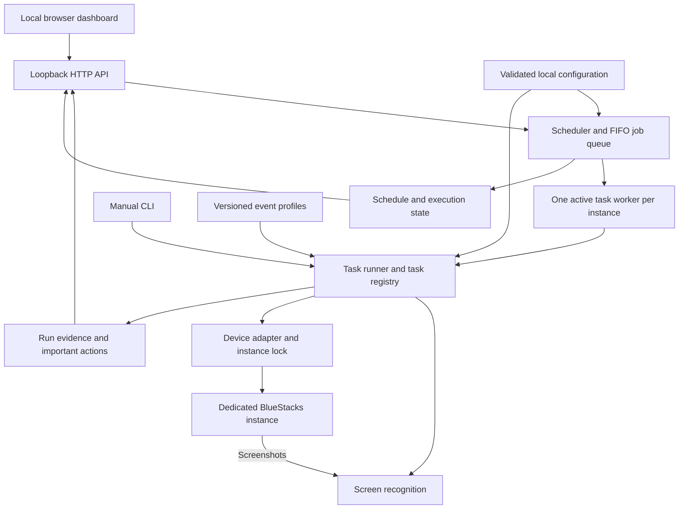
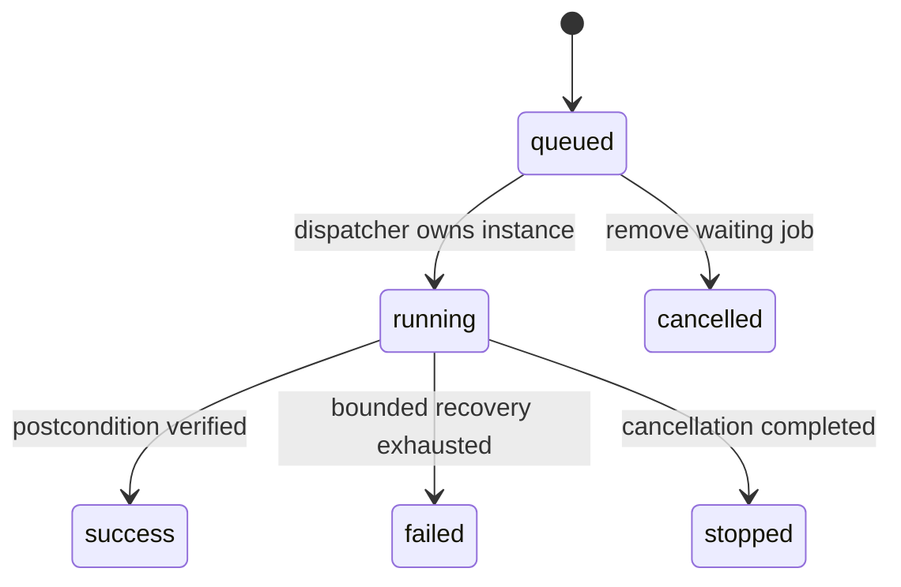

# High-level design

**Project:** Maid in Schale — Blue Archive Automator 
**Status:** working design and implementation guide  
**Last updated:** September 24, 2026

This document sets the direction for the project. It separates the working MVP from the next steps so that new jobs share the same execution, recognition, configuration, and logging rules. [Architecture](architecture.md) describes the current code in more detail; [the roadmap](roadmap.md) records implementation progress. When those documents disagree about future direction, update this design before implementing the change.

## 1. What we are building

A local application that runs Blue Archive's repetitive routines through a dedicated BlueStacks instance. The user chooses the jobs and policies in a browser dashboard. The application queues those jobs, executes them one at a time, verifies the results, and records enough evidence to explain what happened afterward.

The project also serves as an engineering portfolio: someone should be able to understand its design, run its tests, and inspect the dashboard without owning an account or setting up an emulator. Demonstrations must clearly distinguish sample data from actual game results.

### Goals

- Reliable restart and daily routines, beginning with Cafe and expanding one verified job at a time.
- Sequential execution with scheduled and manually queued work using the same runner.
- Explicit resource policies: collect Cafe earnings, eventually spend AP on configured stages, and optionally close the game between runs.
- Local screen recognition using templates, image processing, and OCR. Normal operation makes no LLM or cloud-inference calls.
- Shared core behavior on macOS and Windows, with Blue Archive isolated from an independently running Azur Lane automator.
- Clear status, important-action history, screenshots, and bounded recovery when the game changes.

### Scope boundaries

The initial supported game profile is the global English client at **1280×720, 320 DPI**, with both Cafe floors unlocked. The user signs in manually once; the program reuses that session. BlueStacks must already be running.

Arbitrary resolutions, automatic account switching, unattended external authentication, general-purpose gameplay, and a hosted remote-control service are outside the initial scope. Event farming, additional daily jobs, OS service installation, and emulator lifecycle management are later increments. Optional AI assistance may be considered later, but cannot become a dependency of the ordinary execution path.

## 2. System structure

| Boundary | Responsibility | Rule |
| --- | --- | --- |
| Dashboard/API | Present state, settings, queue controls, and evidence | Never perform game input directly |
| Scheduler/queue | Decide when work is due and preserve its order | Scheduled and manual jobs use one FIFO queue |
| Task runner | Execute prerequisites, task steps, verification, and cancellation | A task declares success only after checking its postcondition |
| Recognition | Convert a screenshot into a recognized state or target with evidence | An unknown screen is a valid outcome, not an invitation to guess |
| Device adapter | Targeted ADB operations and device preflight | Every game command names the configured instance |
| Configuration/profiles | Supply validated preferences and event-specific data | Data does not execute arbitrary code or shell commands |
| Evidence/state storage | Retain outcomes, screenshots, timing, and recovery state | Attempts and confirmed results remain distinct |

The implementation stays a Python application with a small browser frontend. HTTP, game recognition, and task logic remain separate so tests can substitute a fake device, clock, or recognizer. Existing modules can be extracted as their responsibilities grow; adding a new task does not justify rewriting the application.

## 3. Execution model

### Instance ownership

One automation worker controls one configured game instance at a time. An OS lock scoped to the ADB endpoint and game package also excludes a separately launched CLI runner. Controllers targeting the same instance must share the configured `lock_dir`; separate lock directories do not provide mutual exclusion. Blue Archive and Azur Lane use different emulator endpoints; they may share a compatible host ADB server. The Blue Archive adapter must not kill that shared server or disconnect unrelated devices.

### Jobs and tasks

A **job** is one queued request, including its identity, effective configuration, source, timestamps, and result. A **task** is reusable game behavior such as restart, Cafe, or Lessons. A **plan** orders tasks; `daily` starts with restart, a deferred Club placeholder, and Cafe, with Lessons included when its daily setting is enabled.

`tasks.py` supplies a small catalog and ordered task plans shared by the CLI and dashboard. Grow a shared execution context when repeated orchestration needs it instead of extending command-specific conditionals indefinitely. Each task defines:

- Preconditions and a recognized entry route.
- A bounded action sequence, allowed resource use, and cancellation points.
- A verified completion condition and any cooldown or next-eligible time.
- A structured result with a summary, failure reason when applicable, and evidence references.

The execution context supplies the device, recognizer, immutable run configuration, clock, cancellation signal, and evidence writer. `runtime.py` now owns the shared journal, task error, result, and capture contracts used as Lessons becomes the third task. A capture carries its PNG pixels, monotonic timestamp, and foreground evidence; its input deadline includes capture, recognition, and journal time. Restart uses this shared capture; Cafe retains its existing capture tuple while sharing the journal/error/result implementation. Task code does not reach into HTTP state or start another worker. A fuller execution context can follow when it removes repeated orchestration, without adding a general plugin framework.

Restart is the first task in each daily plan. It also restores a known entry state when the game has been closed or a standalone routine begins. Today, both `cafe` and `daily` explicitly run restart first. Later plans may reuse a recently verified home screen between adjacent tasks; they must not infer readiness from the previous task's exit code alone.

Current routines acquire the instance lock separately, so another CLI runner could acquire it between tasks. If a future plan requires uninterrupted ownership, hold one instance lease across the plan and let its tasks use that lease; do not acquire nested locks or assume the HTTP queue excludes external CLI processes.

### Queue and scheduling

Queue pause is separate from job state. Pause allows the active job to finish; Stop interrupts it and pauses further dispatch. Resume permits queued work again. The current dashboard rejects settings changes while any job is active or queued. Accepted changes apply to future work, and a running job keeps its configuration snapshot.

The Cafe schedule runs three hours and 15 seconds after a successful visit. Duplicate due visits are suppressed while equivalent work is active or queued. Failed visits retry after 15 minutes, then pause after three consecutive failures. Future daily schedules must use an explicit game-server reset timezone and date, with an occurrence key that prevents a daily task from being enqueued twice for the same server day.

After the final worker exits, an optional idle policy closes only Blue Archive if the queue is empty. It leaves the emulator, dashboard, and shared ADB server running. This is a once-per-finished-queue action, not a timer that repeatedly closes a manually opened game.

## 4. Recognition and recovery

The control loop is **capture → recognize → act once → verify**. Before input, confirm the selected package is in the foreground and the frame is fresh. Fixed coordinates describe where a recognized control lives; they do not authorize taps on an unrecognized screen.

Use small templates and local color/geometry checks for stable controls, OCR for text and numbers, and scene-feature matching for Cafe movement. Local OCR uses machine-learning models; the requirement is independence from LLM decisions and remote inference services, rather than the absence of all statistical recognition.

Known popups have explicit handlers. A generic dismissal needs supporting evidence such as a dimmed underlying home screen, a plausible modal, and one recognized close control. Save before/after frames and report whether the screen changed. Shading alone does not establish that a popup can be dismissed.

Cafe recognition follows attention icons rather than student or furniture artwork. Camera views overlap, and two independently observed stationary drags establish a boundary. If motion cannot be measured after a short drag, scan that intermediate view and reset movement evidence before proceeding. Unknown motion never proves an edge. A scan's completion and a verified relationship increase are separate outcomes.

Lessons separates screen observation from a pure selection policy. Before spending, enumerate the unlocked locations and their eligible rooms, including visible student ownership, relationship ranks, and location rank/XP when the policy needs them. Unknown ownership or unreadable comparison data must not silently become zero. Use one ticket per action, verify its receipt and ticket decrement, then reread the relevant location state before selecting again. A plan records why a room won the comparison; issuing its confirmation is not proof of a relationship increase.

Every wait, retry loop, repeated action, and complete task has a time or attempt limit. Authentication, unsupported layouts, ambiguous confirmations, and exhausted recovery stop with a useful reason and evidence. A restart after failure begins from a known entry state; it does not blindly replay the last tap.

## 5. Configuration and game-specific policy

Use **TOML** for machine-local instance settings and task preferences. Keep account sessions in the emulator. Keep local configuration, credentials, full screenshots, and runtime history out of Git.

Use **versioned JSON** for event profiles researched before execution. A profile identifies the server, event, playable/reward windows, recognizable entrances, destination checks, and reviewed route parameters. The current schema supplies entrance and destination recognition only. Navigation, stage selection, and farming policies are added alongside the tasks that use them. Expired or unrecognized events stop rather than falling back to a similarly positioned banner. Event Recap remains a separate destination.

New resource-consuming routines require explicit policies: configured stage, maximum repetitions or AP budget, a reserve if needed, and recognizable completion. Collecting Cafe AP clears Cafe storage; preventing the account's AP from sitting at its regeneration cap also requires a mission/sweep job. An issued tap is not proof that resources were spent or rewards received.

Free invitations remain optional and require an exact configured student name. The game cooldown is authoritative. Paid invitations and premium-currency refills are not part of the current routine.

Lessons has two configurable policies. **Relationship** is the default: compare every eligible room across all unlocked locations by owned-student count, then the sum of those students' visible relationship ranks, with a stable final tie-break. **School rank** first chooses the lowest uncapped location rank and fractional XP progress, then the room with the most students, favoring higher owned-student relationship ranks on a tie. Recheck rank and XP after every ticket; when all locations are capped, use the relationship policy. This balances location progression according to the user's preference; it does not claim to minimize the number of tickets until the next aggregate-rank reward. Optional exact location names restrict the comparison scope; an empty list means all locations. A configurable ticket limit caps each visit, with zero meaning all existing tickets. The first version never buys refills. [Lessons](lessons.md) defines the detailed selection and evidence contract.

## 6. Evidence, persistence, and the dashboard

The dashboard should answer: **what is running, what is next, what changed, and what needs attention?** Keep important actions separate from diagnostic logs, with screenshots reachable from the relevant run. A completed job needs a concise verified outcome; failures need their last recognized state and reason.

Today, schedules and important actions persist in JSON/JSONL, evidence lives in per-run directories, and the queue/recent job list are in memory. Preserve this simple storage while the first routines settle. Before promising durable unattended execution, add transactional job persistence—SQLite is the intended local option—with queued jobs restored and interrupted jobs marked for reconciliation. Do not claim exactly-once game actions: a crash can occur between a successful tap and recording its receipt. Recovery must inspect the game's state before deciding whether to repeat an operation.

The real dashboard remains bound to loopback, with Host/Origin validation and CSRF protection for mutations. A portfolio demo uses a separate process, fictional data, and clearly labeled original illustrations. It must neither read the real configuration/history nor expose working device controls.

## 7. Delivery and validation

The current foundation is implemented: restart, a serial dashboard queue, Cafe, Lessons, scheduling, idle-close, important-action history, and event-profile recognition. A full two-floor Cafe visit and a relationship-focused Lessons visit passed on the development Mac. Actual school rank-up handling, optional invitation completion, live Windows operation, and simultaneous operation with ALAS still need live verification. Cross-platform offline tests are evidence about the software, not proof of those live behaviors.

| Next increment | Exit condition |
| --- | --- |
| Portfolio foundation | This design, clear setup/status docs, permissive licensing with third-party asset boundaries, and an isolated account-free demo |
| Cafe repeatability | Scheduled visits after cooldown, named free invitation when available, and useful evidence for any missed/obscured markers |
| Lessons | Inspect all unlocked locations, choose rooms with the configured relationship or school-rank policy, verify each ticket, and return home; live completion is recorded in [Lessons](lessons.md) |
| Next gameplay job after Lessons | Prefer configured mission sweeps to address AP accumulation; choose the stage/resource policy before implementation |
| Other daily routines | Add social, crafting, and reward routines individually through the task contract, with observable entry and exit states |
| Active events | Guarded navigation from reviewed profiles, then configured stage farming with availability and resource checks |
| Unattended distribution | Durable queue/recovery, evidence retention controls, Windows/emulator smoke tests, ALAS coexistence, then optional OS service installation |

A new job is ready when its success condition is explicit, failure/cooldown/timeout/cancellation cases are covered offline, a controlled live run verifies its side effects, and the dashboard explains its result. Screenshot fixtures must be sanitized before committing. Packaging checks must cover installed assets as well as source-tree tests.

Use a permissive license for the project's original code and documentation, while separately identifying game-derived images, trademarks, and dependency licenses. A portfolio presentation should show actual engineering decisions and measured results, label demonstrations honestly, and state the remaining limits.

## 8. Decisions to make when their work begins

- Mission/event stage priorities, AP reserve, repetition limits, and reward-claim order.
- Invitation selection beyond one named student and one successful invitation per visit.
- Club uses the global 19:00 UTC reset policy; live attendance evidence and durable per-day suppression remain pending the fresh-reset test. See [Club](club.md).
- Recovery semantics and migrations when durable job storage is introduced.
- Platform-specific emulator discovery and service installation after live portability checks.
- Whether optional AI assistance adds value; the deterministic execution path remains usable without it.

These are implementation inputs for later increments, not reasons to expand the current MVP automatically.
