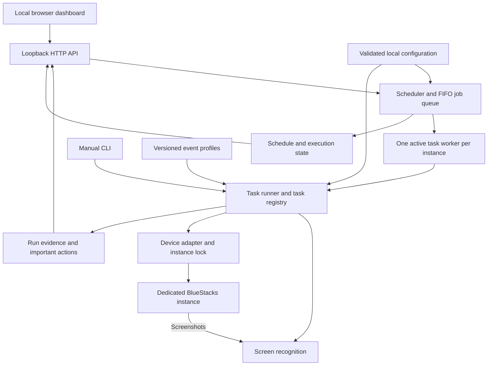
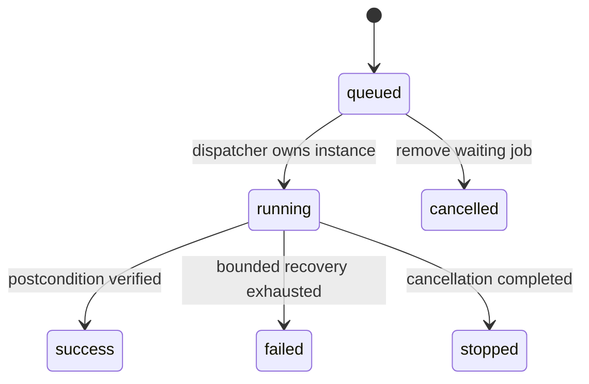

# High-level design

**Project:** Maid in Schale — Blue Archive Automator 
**Status:** working design and implementation guide  
**Last updated:** September 24, 2026

This document sets the direction for the project. It separates the working MVP from the next steps so that new jobs share the same execution, recognition, configuration, and logging rules. [Architecture](architecture.md) describes the current code in more detail; [the roadmap](roadmap.md) records implementation progress. When those documents disagree about future direction, update this design before implementing the change.

## 1. What we are building

A local application that runs Blue Archive's repetitive routines through a dedicated BlueStacks instance. The user chooses the jobs and policies in a browser dashboard. The application queues those jobs, executes them one at a time, verifies the results, and records enough evidence to explain what happened afterward.

The project also serves as an engineering portfolio: someone should be able to understand its design, run its tests, and inspect the dashboard without owning an account or setting up an emulator. Demonstrations must clearly distinguish sample data from actual game results.

### Goals

- Reliable restart and daily routines, beginning with Cafe and expanding one verified job at a time.
- Sequential execution with scheduled and manually queued work using the same runner.
- Explicit resource policies: collect Cafe earnings, spend AP on configured stages above a reserve, and optionally close the game between runs.
- Local screen recognition using templates, image processing, and OCR. Normal operation makes no LLM or cloud-inference calls.
- Shared core behavior on macOS and Windows, with Blue Archive isolated from an independently running Azur Lane automator.
- Clear status, important-action history, screenshots, and bounded recovery when the game changes.

### Scope boundaries

The initial supported game profile is the global English client at **1280×720, 320 DPI**, with both Cafe floors unlocked. The user signs in manually once; the program reuses that session. BlueStacks must already be running.

Arbitrary resolutions, automatic account switching, unattended external authentication, general-purpose gameplay, and a hosted remote-control service are outside the initial scope. Event farming, additional daily jobs, OS service installation, and emulator lifecycle management are later increments. Optional AI assistance may be considered later, but cannot become a dependency of the ordinary execution path.

## 2. System structure

| Boundary | Responsibility | Rule |
| --- | --- | --- |
| Dashboard/API | Present state, settings, queue controls, and evidence | Never perform game input directly |
| Scheduler/queue | Decide when work is due and preserve its order | Scheduled and manual jobs use one FIFO queue |
| Task runner | Execute prerequisites, task steps, verification, and cancellation | A task declares success only after checking its postcondition |
| Recognition | Convert a screenshot into a recognized state or target with evidence | An unknown screen is a valid outcome, not an invitation to guess |
| Device adapter | Targeted ADB operations and device preflight | Every game command names the configured instance |
| Configuration/profiles | Supply validated preferences and event-specific data | Data does not execute arbitrary code or shell commands |
| Evidence/state storage | Retain outcomes, screenshots, timing, and recovery state | Attempts and confirmed results remain distinct |

The implementation stays a Python application with a small browser frontend. HTTP, game recognition, and task logic remain separate so tests can substitute a fake device, clock, or recognizer. Existing modules can be extracted as their responsibilities grow; adding a new task does not justify rewriting the application.

## 3. Execution model

### Instance ownership

One automation worker controls one configured game instance at a time. An OS lock scoped to the ADB endpoint and game package also excludes a separately launched CLI runner. Controllers targeting the same instance must share the configured `lock_dir`; separate lock directories do not provide mutual exclusion. Blue Archive and Azur Lane use different emulator endpoints; they may share a compatible host ADB server. The Blue Archive adapter must not kill that shared server or disconnect unrelated devices.

### Jobs and tasks

A **job** is one queued request, including its identity, effective configuration, source, timestamps, and result. A **task** is reusable game behavior such as restart, Cafe, or Lessons. A **plan** orders tasks; `daily` starts with restart, Club attendance, the free daily pack, optional paid-pack checks, Mail, and Cafe, with Tactical Challenge reward collection, and Bounties, Scrimmages, and Lessons included when their daily settings are enabled with opt-in Total Assault after Lessons and Spend AP appended when automatic spending is enabled. Tasks collection finishes the daily activities, checking its home red dot and claiming completed rewards after the activities that earn them.

Total Assault rank and points collection is independent of optional raid combat. The `assault_rewards` task runs after raid combat and in Daily even when combat is disabled. The final notification scan checks both Home and Campaign using two matching red-dot observations, then returns home before publishing allowlisted queue requests. Campaign notifications can request reward collection, never ticket spending. Requests are deduplicated within the current busy queue batch; amber availability markers are not reward notifications.

`tasks.py` supplies a small catalog and ordered task plans shared by the CLI and dashboard. Grow a shared execution context when repeated orchestration needs it instead of extending command-specific conditionals indefinitely. Each task defines:

- Preconditions and a recognized entry route.
- A bounded action sequence, allowed resource use, and cancellation points.
- A verified completion condition and any cooldown or next-eligible time.
- A structured result with a summary, failure reason when applicable, and evidence references.

The execution context supplies the device, recognizer, immutable run configuration, clock, cancellation signal, and evidence writer. `runtime.py` now owns the shared journal, task error, result, and capture contracts used as Lessons becomes the third task. A capture carries its PNG pixels, monotonic timestamp, and foreground evidence; its input deadline includes capture, recognition, and journal time. Restart uses this shared capture; Cafe retains its existing capture tuple while sharing the journal/error/result implementation. Task code does not reach into HTTP state or start another worker. A fuller execution context can follow when it removes repeated orchestration, without adding a general plugin framework.

Restart is the first task in each daily plan. It also restores a known entry state when the game has been closed or a standalone routine begins. Today, both `cafe` and `daily` explicitly run restart first. Later plans may reuse a recently verified home screen between adjacent tasks; they must not infer readiness from the previous task's exit code alone.

Current routines acquire the instance lock separately, so another CLI runner could acquire it between tasks. If a future plan requires uninterrupted ownership, hold one instance lease across the plan and let its tasks use that lease; do not acquire nested locks or assume the HTTP queue excludes external CLI processes.

### Queue and scheduling

Queue pause is separate from job state. Pause allows the active job to finish; Stop interrupts it and pauses further dispatch. Resume permits queued work again. The current dashboard rejects settings changes while any job is active or queued. Accepted changes apply to future work, and a running job keeps its configuration snapshot.

The Cafe schedule runs three hours and 15 seconds after a successful visit. Duplicate due visits are suppressed while equivalent work is active or queued. Failed visits retry after 15 minutes, then pause after three consecutive failures.

The optional Daily schedule uses the Global reset at 19:00 UTC plus a configurable delay of 0–120 minutes (default one minute). The server queues the current game day's plan after that deadline, including after downtime; older missed days are not replayed. UTC reset arithmetic avoids local daylight-saving shifts. Manual dashboard Daily runs also count toward that game day's occurrence. Daily and timer work share the serial queue and honor queue pause.

An instance-scoped occurrence is persisted before Daily dispatch and finalized with its result. A completed, failed, stopped, or interrupted occurrence suppresses automatic replay for that game day. Failed or interrupted work needs review followed by an explicit manual Daily retry; cancellation of an automatically queued Daily records a skipped occurrence. A fresh game day permits new work. This controls scheduling, not exactly-once game actions or resumption of individual steps. Existing resource-intent holds remain authoritative. The dashboard exposes the latest result, any blocking reason, and the next due time. The local server and awake host are still required; no system service or wake timer is installed.

Within Daily, a recognized task failure or resource hold is isolated to that step. The runner records it, uses the bounded restart task to verify home, then continues with later independent tasks, including Spend AP. It never retries the failed step or releases its resource hold. Device, lock, configuration, filesystem, unexpected errors, and unsuccessful recovery still stop the plan. A structured summary lists completed, failed, deferred, and skipped steps; partial completion remains a failed occurrence with its actual failures visible in the dashboard.

Periodic check-ins keep the game observed between scheduled jobs. They default to every 30 minutes, configurable from 5 minutes to 24 hours or disabled. A check-in runs Restart and the existing home notification scan through the same serial queue; recognized red dots enqueue their reward jobs, and observed AP can enqueue Spend AP under its configured floor and resource holds. A successful final scan from another job also covers the interval. Check-ins wait behind existing work and honor Pause.

The next check-in deadline persists per instance before dispatch. Downtime produces at most one overdue visit, and a failed or interrupted visit waits another interval instead of permanently disabling the timer. Brief state-lock contention defers a minute; invalid or unwritable timer state holds only check-ins and is exposed in the queue schedule summary. Neither check-ins nor their retries clear uncertain spending intents or bypass a job's own eligibility checks.

After the final worker exits, an optional idle policy closes only Blue Archive if the queue is empty. It leaves the emulator, dashboard, and shared ADB server running. This is a once-per-finished-queue action, not a timer that repeatedly closes a manually opened game.

### AP spending

Bounties and Scrimmages split the first observed available ticket count equally across their three areas, rotating remainder tickets by the Global game day's weekday modulo three. Each area uses its highest surveyed three-star clear. Per-instance allocation and completed counts persist across retries; an intent is saved before spending and cleared only after receipt and balance verification. Scrimmages also respects the AP floor. These jobs are optional steps in Daily, with explicit standalone queue commands. See [ticket jobs](tickets.md).

Spend AP is a separate queued job with an integer reserve floor (default 100). Automatic operation is opt-in: check hourly and append a visit after Cafe/mail or at the end of Daily. Periodic check-ins and other final home scans can queue an earlier visit when they observe excess AP; the runner still verifies each stage's actual cost before spending. Survey is a separate read-only job. The dedicated AP page presents only scanned three-star Hard stages, supports drag-and-drop plus keyboard/text editing, and validates saved orders on the server.

The default Eleph policy rotates one sweep per stage, highest numeric Hard stage first, retaining its next-stage cursor between jobs. Custom orders may omit stages. Exhausted attempts are skipped; the job never pays for resets. Commission policies rescan the entire stage list and select the highest verified three-star Base Defense or Item Retrieval stage. Read AP, unit cost, selected count, and the resulting balance from the game; require the game's final confirmation to agree and stay above the floor. Never round a budget upward or buy AP to continue.

Save a pending intent before confirming an AP sweep. Require a reward receipt, the projected AP decrement, and (for Hard) the expected remaining-attempt count before advancing the cursor. Uncertain outcomes block further spending. Catalogs, cursor, holds, and schedules persist per instance. Return to home and log each confirmed spend with stage, count, AP before/after, and local receipt evidence. See [AP spending](spend-ap.md).

## 4. Recognition and recovery

The control loop is **capture → recognize → act once → verify**. Before input, confirm the selected package is in the foreground and the frame is fresh. Fixed coordinates describe where a recognized control lives; they do not authorize taps on an unrecognized screen.

Use small templates and local color/geometry checks for stable controls, OCR for text and numbers, and scene-feature matching for Cafe movement. Local OCR uses machine-learning models; the requirement is independence from LLM decisions and remote inference services, rather than the absence of all statistical recognition.

Known popups have explicit handlers. A generic dismissal needs supporting evidence such as a dimmed underlying home screen, a plausible modal, and one recognized close control. Save before/after frames and report whether the screen changed. Shading alone does not establish that a popup can be dismissed.

Cafe recognition follows attention icons rather than student or furniture artwork. Camera views overlap, and two independently observed stationary drags establish a boundary. If motion cannot be measured after a short drag, scan that intermediate view and reset movement evidence before proceeding. Unknown motion never proves an edge. A scan's completion and a verified relationship increase are separate outcomes.

Lessons separates screen observation from a pure selection policy. Before spending, enumerate the unlocked locations and their eligible rooms, including visible student ownership, relationship ranks, and location rank/XP when the policy needs them. Unknown ownership or unreadable comparison data must not silently become zero. Use one ticket per action, verify its receipt and ticket decrement, then reread the relevant location state before selecting again. A plan records why a room won the comparison; issuing its confirmation is not proof of a relationship increase.

Every wait, retry loop, repeated action, and complete task has a time or attempt limit. Authentication, unsupported layouts, ambiguous confirmations, and exhausted recovery stop with a useful reason and evidence. Android can report an activity-draw timeout even when the game has opened; that advisory continues to screen recognition only after verifying the configured game is in the foreground. Explicit launch errors and transport timeouts still fail. If the startup budget expires, Restart saves the timeout frame and force-stops/relaunches the selected game once under the same instance lock. Only its startup budget resets; the original download deadline and total tap limit remain in force. Recovery and its outcome are important actions. Exhausting the second startup budget stops the plan. This retry is confined to startup, before resource tasks begin; a failed spending task is never replayed by it.

## 5. Configuration and game-specific policy

Use **TOML** for machine-local instance settings and task preferences. Keep account sessions in the emulator. Keep local configuration, credentials, full screenshots, and runtime history out of Git.

Use **versioned JSON** for event profiles researched before execution. A profile identifies the server, event, playable/reward windows, recognizable entrances, destination checks, and reviewed route parameters. The current schema supplies entrance and destination recognition only. Navigation, stage selection, and farming policies are added alongside the tasks that use them. Expired or unrecognized events stop rather than falling back to a similarly positioned banner. Event Recap remains a separate destination.

New resource-consuming routines require explicit policies: configured stage, maximum repetitions or AP budget, a reserve if needed, and recognizable completion. Collecting Cafe AP clears Cafe storage; preventing the account's AP from sitting at its regeneration cap also requires a mission/sweep job. An issued tap is not proof that resources were spent or rewards received.

Paid packs are a separately enabled exception to ordinary game-resource spending. Each supported permanent pack has an explicit opt-in and USD price ceiling. Require matching product and price in both game and Play checkout, persist intent before charging, verify delivery, and then collect product mail. Every payment failure disables scheduled pack checks. Uncertain charges require ownership reconciliation before any retry. Google authentication remains manual, and payment screens are excluded from saved evidence. See [Packs and Mail](packs-and-mail.md).

Free invitations are opt-in and off by default. An exact configured student name overrides automatic selection; a blank name chooses the highest relationship rank below its current cap. The picker verifies an empty search field, descending relationship order, list boundaries, and overlapping scroll observations before selecting. Unreadable comparison evidence stops selection rather than silently favoring a lower-ranked student.

Current relationship caps are 10 for one/two stars, 20 for three stars, 30 for four stars, and 100 for five stars. The four-star cap increased in the [January 13, 2026 patch](https://forum.nexon.com/bluearchive-en/board_view?board=3028&thread=3336837). At ranks 10, 20, or 30, automatic selection inspects the exact student's current profile stars, returns to the original Cafe, and rereads the invitation list. Rank 100 is skipped. Base rarity is not evidence of an account's upgraded rarity. Require a fresh selected row, exact-name confirmation, and a new cooldown before logging success. The game cooldown is authoritative; bonus invitations and premium-currency refills are unsupported.

Lessons has two configurable policies. **Relationship** is the default: compare every eligible room across all unlocked locations by owned-student count, then the sum of those students' visible relationship ranks, with a stable final tie-break. **School rank** first chooses the lowest uncapped location rank and fractional XP progress, then the room with the most students, favoring higher owned-student relationship ranks on a tie. Recheck rank and XP after every ticket; when all locations are capped, use the relationship policy. This balances location progression according to the user's preference; it does not claim to minimize the number of tickets until the next aggregate-rank reward. Optional exact location names restrict the comparison scope; an empty list means all locations. A configurable ticket limit caps each visit, with zero meaning all existing tickets. The first version never buys refills. [Lessons](lessons.md) defines the detailed selection and evidence contract.

## 6. Evidence, persistence, and the dashboard

The dashboard should answer: **what is running, what is next, what changed, and what needs attention?** Keep important actions separate from diagnostic logs, with screenshots reachable from the relevant run. A completed job needs a concise verified outcome; failures need their last recognized state and reason.

The main controls are **Do everything** and **Pause queue**. Do everything resumes dispatch and requests one catch-up pass after the current batch, including its follow-up jobs, finishes. Repeated clicks coalesce into that pass. The pass queues enabled work through the ordinary due-time checks, then always scans for red dots and excess AP. It preserves resource holds, spending settings, the AP floor, and the durable Daily occurrence; it cannot replay an already attempted Daily just by resuming. Pause remains effective while catch-up is pending. Specific task buttons, plain Resume, and immediate Stop live in collapsed manual controls. Failed-job notices appear directly below the main controls.

Today, purchase intent, daily occurrences, failed-job notices, schedules, and important actions persist in JSON/JSONL, evidence lives in per-run directories, and the queue/recent job list are in memory. Preserve this simple storage while the first routines settle. Before promising durable unattended execution, add transactional job persistence—SQLite is the intended local option—with queued jobs restored and interrupted jobs marked for reconciliation. Do not claim exactly-once game actions: a crash can occur between a successful tap and recording its receipt. Recovery must inspect the game's state before deciding whether to repeat an operation.

Failed-job notices persist separately from the live runner log and remain visible until acknowledged. Acknowledging a notice does not clear a paid-purchase hold or re-enable its schedule.

The full-day text log is linked beside important actions and saved as `state_dir/logs/YYYY-MM-DD.log`, using the host's local calendar date and offset-aware timestamps. The daemon and task subprocesses append queue decisions, task journals, outcomes, diagnostics, and important actions to the same file. A cross-process lock preserves complete entries; midnight selects a new date without discarding earlier logs. Historical imports are idempotent and label reconstructed timestamps. See [daily logs](daily-logs.md).

The real dashboard remains bound to loopback, with Host/Origin validation and CSRF protection for mutations. A portfolio demo uses a separate process, fictional data, and clearly labeled original illustrations. It must neither read the real configuration/history nor expose working device controls.

## 7. Delivery and validation

The current foundation is implemented: restart, a serial dashboard queue, Cafe, Lessons, scheduling, idle-close, important-action history, and event-profile recognition. A full two-floor Cafe visit, automatic free invitation, and relationship-focused Lessons visit passed on the development Mac. Current-star lookup passed separately; its complete boundary-rank reselection flow, deep invitation scrolling, and the configured-name path remain offline-tested. Actual school rank-up handling, live Windows operation, and simultaneous operation with ALAS still need live verification. Cross-platform offline tests are evidence about the software, not proof of those live behaviors.

| Next increment | Exit condition |
| --- | --- |
| Portfolio foundation | This design, clear setup/status docs, permissive licensing with third-party asset boundaries, and an isolated account-free demo |
| Cafe repeatability | Scheduled visits after cooldown, invitation boundary-rank reselection and deep scrolling, a configured-name invitation, and useful evidence for missed/obscured markers |
| Lessons | Inspect all unlocked locations, choose rooms with the configured relationship or school-rank policy, verify each ticket, and return home; live completion is recorded in [Lessons](lessons.md) |
| Spend AP | Sweep highest three-star commissions or a persisted Hard-stage round robin without crossing its AP reserve; see [Spend AP](spend-ap.md) |
| Crafting | Fill saved-preset Quick Craft slots; persist per-slot collection jobs; verify collection and refill after natural completion |
| Other daily routines | Add social and reward routines individually through the task contract, with observable entry and exit states |
| Active events | Guarded navigation from reviewed profiles, then configured stage farming with availability and resource checks |
| Unattended distribution | Durable queue/recovery, evidence retention controls, Windows/emulator smoke tests, ALAS coexistence, then optional OS service installation |

A new job is ready when its success condition is explicit, failure/cooldown/timeout/cancellation cases are covered offline, a controlled live run verifies its side effects, and the dashboard explains its result. Screenshot fixtures must be sanitized before committing. Packaging checks must cover installed assets as well as source-tree tests.

Use a permissive license for the project's original code and documentation, while separately identifying game-derived images, trademarks, and dependency licenses. A portfolio presentation should show actual engineering decisions and measured results, label demonstrations honestly, and state the remaining limits.

## 8. Decisions to make when their work begins

- Event-specific stage priorities, repetition limits, and reward-claim order. The ordinary AP floor and Hard rotation are configured on the Spend AP page.
- Invitation policies beyond highest uncapped relationship or an exact name, and more than one successful invitation per visit.
- Club uses the global 19:00 UTC reset policy; live attendance and its mailbox AP receipt are verified, with durable per-instance suppression after an observed Club visit. See [Club](club.md).
- Recovery semantics and migrations when durable job storage is introduced.
- Platform-specific emulator discovery and service installation after live portability checks.
- Whether optional AI assistance adds value; the deterministic execution path remains usable without it.

These are implementation inputs for later increments, not reasons to expand the current MVP automatically.

### Loot gathered

The dashboard has a durable, clearable reward view over confirmed receipts. A shared deterministic reader inspects item tooltips, received quantities, and game icons before dismissal. Sweeps use only the Final row and expand Full List when additional rewards are hidden. The view groups identical items by importance, preserves itemized receipts, and marks unknown quantities or names for review. Receipt identity joins observation and later task-completion records without double-counting; late enrichment never resurrects cleared loot. See [loot accounting and recognition](loot.md).

Relationship rank-ups share that view as individual progression events, separate from inventory totals. Café and Lessons capture the celebration's new rank and displayed stat increments before dismissing it. A student name requires verified context; the portrait alone does not identify them. Unknown values remain unknown, ordinary heart feedback does not prove a level-up, and repeated reads of a lingering celebration do not create extra gains. Clearing the view preserves the original action and screenshot history.

Clearing saves a cursor at the last complete JSONL record and a timestamp. It does not remove action history or receipt files, and concurrent later appends belong to the fresh view. Totals include all records since that cursor; the gallery shows the latest 100. Receipt endpoints accept a validated action ID and serve only the recorded PNG beneath the configured run directory. Existing older actions without receipt paths retain their known totals and text. New Cafe, Mail, Crafting, Lesson, AP and ticket jobs attach their saved reward receipts.

Home notifications are checked after successful task plans. Two stable home frames produce a bounded queue request for free packs, Club, Mail, and Tasks; dispatch deduplicates tasks across the busy batch before optional idle closure. Fresh AP at least 20 above the configured floor can enqueue automatic Spend AP without overriding failure holds. No idle polling or AI is involved. See [red-dot collection](red-dots.md).

Tactical Challenge separates reward collection from battle policy. The reward task only reaches Campaign, enters Tactical Challenge, claims the two recognized reward controls once each, verifies receipts and unchanged tickets, then returns home. Battle execution is a no-input deferred stub outside the dispatch allowlist. See [Tactical Challenge](tactical-challenge.md).

## Total Assault policy

Total Assault has a configurable target difficulty, defaulting to Hardcore, and separate opt-in Daily inclusion. An observed prerequisite ladder may require easier clears, but every real entry needs a winning mock at that difficulty. Auto formation is tested first. A failed or marginal mock may replace the least-damage striker with an eligible assistant matching the attack type, ordered by stars then level, followed by a second mock. The exact passing team is reused for real entry; remaining tickets are swept only after the target clear and sweep eligibility are verified. Unavailable assistants, unreadable evidence, or unsuccessful mocks produce a player-facing failure rather than an untested real attempt. See [Total Assault](total-assault.md).
