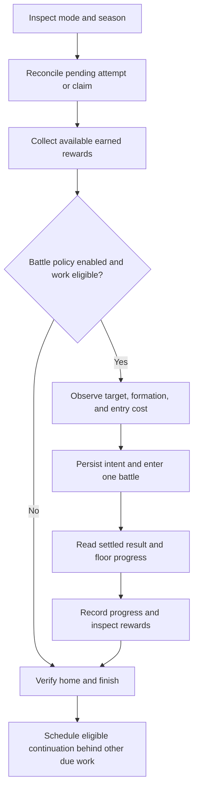

# Final Restriction Release — design proposal

**Status:** design only; no job, settings, or game actions are added by this document.

**Reviewed:** September 26, 2026.

**First boss:** The Fury of Set. The runner must still verify the season, armor variant, and progress on the development account.

the idea: clear what our team can handle, collect the rewards, and leave it alone until there's a reason to try again. don't spend the whole evening losing to the same floor while AP piles up.

This extends the [project design](design.md) and existing serial queue. Final Restriction Release is the mode; The Fury of Set is a rotating boss. Give the task a mode-level identity so a new boss does not require renaming settings or mixing its history with [Total Assault](total-assault.md).

## Game rules and evidence

The official Global [Final Restriction Release guide](https://forum.nexon.com/bluearchive-en/board_view?allBoard=1&board=3222&thread=2727380) documents:

- Entry through Home → Campaign; unlock after Normal Mission 5-1.
- One team of up to six Strikers and four Specials. A defeated team cannot be replaced to continue the same attempt.
- Unlimited entries during the season, rather than a daily ticket allowance.
- 124 floors in tiers 1–24, 25–49, 50–74, 75–99, and 100–124. Clearing a tier's last floor unlocks the next tier.
- Rewards through the highest cleared floor, including unplayed lower floors. Rewards include credits, enhancement materials, and Talent Unlock workbooks.
- Five skill cards and a maximum battle cost of 20.
- Assistants cannot duplicate a student in the formation; general-user borrowing can cost more than friend/club borrowing.

The guide describes January 2025 rules. The official [August 18, 2026 update](https://forum.nexon.com/bluearchive-en/board_view?thread=3520505) subsequently expanded the configurable starting-skill sequence to nine. That is a different control from the number of cards visible during combat.

The official [September 15, 2026 patch notes](https://forum.nexon.com/bluearchive-en/board_view?thread=3541757) list the current season as **September 16, 02:00 UTC → October 12, 18:59 UTC**: Set, Special Armor, Field Warfare terrain, Normal attack on floors 1–49, and Explosive attack on 50–124. Treat that as the expected profile, not proof of the account's current screen or unlocked floors. Historical seasons have also used [Light Armor](https://forum.nexon.com/bluearchive-en/board_view?board=3217&thread=2886939); a profile must not match on the boss name alone.

**Capture before implementation:** current entry/assistant costs, exact team and starting-skill controls, claim behavior, season rollover, battle/result screens, and whether any practice or sweep control exists. Unlimited entries does not prove every confirmation is free. The first version requires an observed zero AP/ticket entry cost and never assumes a Total Assault-style mock, sweep, or daily-clear requirement.

## First version

Implement a daily inspection and reward collector, then add opt-in climbing with a player-prepared formation and the game's Auto skills. The initial proposed target is **floor 24**, configurable. This is a conservative first-tier validation target, not a claim that this account can already clear it.

The user can choose:

| Policy | Behavior |
| --- | --- |
| Collect only | Inspect the season and collect earned rewards. Never enter combat. Default when enabling daily checks. |
| Reach a target | Work toward a chosen floor, including required tier-ending clears; stop once verified. |
| Climb until blocked | Advance through reviewed checkpoints up to a user-set ceiling. Stop after the configured attempt budget or a confirmed failure. |

All three inspect regardless of badge color. A red dot may request reward collection, but cannot opt the user into battles. “Target reached,” “season closed,” and “team needs attention” are explicit states, not generic failures.

The first version does not upgrade students, equipment, skills, rarity, or talents. It does not spend gifts, Pyroxenes, or AP. It does not promise to solve higher floors with Auto. Exact skill sequences and roster optimization are later increments, still driven by reviewed local data with no runtime AI.

## Team policy

Start with a saved formation the user has prepared for the observed boss and armor. Verify each occupied slot, role, student identity, visible level, and any assistant before entry. Preserve slot order and starting skills: order can change Auto behavior. Keep a local team signature so the same failed setup is not retried every day.

For the first version, require a fully prepared ten-student team; this is our policy, not a claim that the game forbids empty slots. An empty slot or unsupported formation produces a useful setup message. Do not silently reuse Total Assault's six-slot reader or fill missing roles with the highest-level students. Ten slots need their own fixtures. A later deterministic team builder can select from a reviewed boss profile with required roles, acceptable substitutions, and minimum observed investment. It must explain every substitution and stop when a required role cannot be filled.

Assistant use is separately opt-in. Initially support at most one borrowed student as our implementation policy, pending verification of the game's current limits. A profile identifies the role and allowed student identities; stars and level only break ties among candidates that meet those requirements. This avoids replacing a needed healer or support with a stronger-looking damage dealer. Record the lender and student, verify the final formation, and enforce a configured credit ceiling for each entry and the whole climb session. Unknown fees or availability stop before confirmation. The first version can ship without assistant automation while retaining this boundary.

Skill execution starts with **game Auto**, verified on screen. Preserve the user's starting-skill sequence. Later profiles may specify a supported sequence, but cannot assume that every client uses the old five-selection UI or that nine selections mean nine cards in hand. A future scripted controller must recognize the actual student card and target, wait for sufficient cost, and use battle-state guards; elapsed wall-clock coordinates alone are inadequate.

## Floor planning

Build an observed map of selectable floors, clear markers, tier gates, and claim status. Merge overlapping observations without allowing an unreadable row to erase definite evidence. Conflicting evidence requires another observation before acting.

For target 49 with only the first tier available, the plan is **24 → verify next tier → 49**. It does not grind floors 1–23, and it does not attempt a locked 49 because a profile says it ought to be available. If a target lies inside a tier, select that target once its prerequisites are observed unlocked.

For climb mode, use reviewed checkpoints: initially the tier ends, bounded by the requested ceiling. A failed checkpoint can optionally fall back once to a lower, unclaimed floor in the same tier if the user enabled fallback. Do not infer that every mechanic scales monotonically or binary-search across tier boundaries. Any fallback is logged as a lower target, not success at the original target.

Default retry policy: one completed attempt per floor/team signature, up to two attempts per climb session. A confirmed loss holds the specific `(season, floor, team/profile signature)` and ends the climb unless the optional lower-floor fallback is eligible within the remaining budget. That fallback does not erase the failed checkpoint. Daily inspection may collect rewards and detect a new season, but does not clear a loss simply because the date changed. A formation/profile change or explicit “try again” permits another bounded attempt. Visible level/rarity changes update the signature; investment that the reader cannot verify requires an explicit retry. A disconnected or unreadable result is an unresolved attempt, not a loss eligible for an automatic retry.

## Execution and recovery



Every input uses a fresh screenshot and the existing instance lock. Navigation verifies the mode heading and boss identity rather than using a Campaign coordinate alone. During combat, tolerate recognized animations and loading screens within a wall-clock deadline derived from the profile's game timer plus loading allowance. Never tap blindly to keep a fight moving.

Before entry persist an intent with season identity, floor, team/profile signature, expected costs, and evidence references. A win requires a settled victory result and the observed floor progress afterward. Boss HP reaching zero alone is insufficient. A result animation may delay labels, so wait and recapture before concluding the name, floor, or reward is missing.

After interruption, inspect the foreground before a force restart can erase useful result evidence. Reconcile a still-open battle/result, the highest-clear marker, and claim status with the saved intent. A verified clear can resolve an entry intent without inventing a missing receipt. If the screen cannot establish what happened, hold this mode and expose the evidence; keep independent daily jobs running once home can be verified. Do not clear an ambiguous assistant charge or claim intent just to retry.

This requires a shared pending-intent preflight in Restart and idle-close, like Tactical Challenge's existing protection. Recover an open Final Restriction Release battle/result before an unrelated job can close the game. After evidence is secured and home is safe, independent jobs can proceed while this mode remains held. Adding recovery only inside the new runner is insufficient.

Season identity includes server, boss, armor, terrain, and observed start/end period, including the year. A new season invalidates prior clear progress and team qualification but preserves history and every unresolved entry, assistant-charge, and claim intent. Use the game's actual participation and claim windows; do not hard-code a calendar-month reset or assume the Global daily reset starts a new season.

## Scheduling without starving the dailies

Use the existing queue and Daily scheduler. Add a short `restriction_check` near the end of Daily, **after Spend AP**, regardless of notification dots. It observes state and publishes eligible claim or battle continuation requests. It does not run an entire climb or long receipt inspection inside Daily. A standalone check and “do everything” use the same eligibility rules.

Bound inspection separately from claiming. The existing generic receipt timeout can last 15 minutes, so call a reward visit “bounded,” not necessarily “short.” A `restriction_claim` continuation handles at most one observed claim batch and finishes reading or safely preserving its receipt before yielding. Additional batches wait behind due work. Set its receipt deadline from validated layouts; reaching that deadline preserves a pending claim rather than clicking Claim again. Already-open result recovery takes precedence over routine discovery.

`restriction_battle` executes at most **one battle per queue visit**, then verifies home and releases the instance. Before queuing a continuation, let due Cafe, Crafting collections, red-dot collectors, and AP spending enter the queue. This needs an explicit follow-up ordering rule and tests; merely appending a self-request immediately could otherwise monopolize an empty queue before timers are evaluated.

Define a **visit** as one queued child job and a **climb session** as the persisted budget shared by related visits. Proposed defaults are two attempts and 20 minutes of cumulative active execution. Time waiting behind other jobs does not consume that active budget. Give the session a stable ID and expire unused continuation eligibility at the next game-day boundary or season end, whichever comes first. The next enabled daily inspection or an explicit user request may open a new session if unfinished work remains; the separate floor/team loss memory still applies. Redispatch, daemon restart, and settings toggles do not renew budgets.

Account for elapsed active time durably so restarting a process cannot replenish it. Do not start an attempt when the remaining session budget cannot cover the profile's battle/loading bound. Once a battle starts, finish observing it within its own deadline; session expiry is not permission to abandon a result halfway through. Queue Pause finishes the current visit and prevents continuation. Stop interrupts at the existing cancellation points and preserves pending intent.

Persist continuation eligibility and its next-check time, because the current FIFO queue does not survive a daemon restart. Reconstruct at most one eligible continuation, honor pause and disabled settings, and never treat a restart as a new retry budget. Daily occurrence tracking remains separate from seasonal progress and attempt accounting.

## Proposed settings and dashboard

These keys are illustrative and **not accepted by the current configuration parser**:

```toml
[final_restriction_release]
enabled_in_daily = false
policy = "collect_only"       # collect_only | target | climb
target_floor = 24             # also the upper limit for climb
team_policy = "saved"
battle_policy = "game_auto"
max_attempts_per_session = 2  # shared by single-battle continuations
max_session_active_minutes = 20  # excludes queue waits
fallback_after_loss = false
assistant_enabled = false
assistant_max_credits_per_entry = 0
assistant_max_credits_per_session = 0
```

Validate floor bounds against the active reviewed profile, finite attempt/time limits, supported enums, and nonnegative credit ceilings. A boss/profile change requires fresh observations, not silent reuse of an old armor-specific team plan. Settings are snapshotted at dispatch, consistent with existing jobs.

In Settings, show **Final Restriction Release** with the current boss beneath it. Expose the daily switch, policy, target floor, and saved-team readiness first; keep budgets and assistant limits under advanced options. Show whether Daily itself is enabled so an apparently enabled job cannot quietly lack a timer.

The status card should say something concrete: “Set · floor 24 cleared · target 49 · next attempt after Cafe,” “target reached for this season,” or “floor 49 lost with this team; change formation or try again.” Use text and icons as well as color. Keep manual actions under existing manual controls; do not add another row of queue buttons.

## Rewards, logs, and state

Reuse Loot Gathered's exact-name, quantity, icon, tooltip, and receipt handling. Store verified rewards from all newly claimed floors as one claim operation with itemized contents; do not multiply one cumulative receipt by the number of floors skipped. A predicted reward preview is not loot. Reopening a receipt must enrich its existing record, not add the same rewards again.

Persist separate facts: highest verified clear, observed claimable rewards, claim intent, and verified receipt. Clearing the dashboard's loot totals does not reset any of those facts. If a receipt is incomplete, retain its evidence and partial status without reporting an invented total. Workbooks are leveling/talent materials; add exact-name catalog entries after observing them rather than placing them under equipment by default.

Important Actions and the existing `YYYY-MM-DD.log` record the season survey, chosen floor and reason, team/assistant changes, entry cost intent, confirmed charges, win/loss and game time, newly unlocked tier, every reward claim, and reason for stopping. Opponent/lender account identifiers remain local. Sanitized regression fixtures and fictional demo data are the only account-like evidence committed to the public repository.

Proposed per-instance state contains:

- A schema version, season identity, observation time, and profile version/hash.
- Highest verified floor, observed unlocked tiers, target, and completion reason.
- Team signature; attempted floor/signature pairs and their verified outcomes.
- Pending entry/assistant/claim intent with unique operation and receipt identifiers.
- Session attempt/credit/time budget, continuation deadline, and blocked reason.

Follow the existing atomic state-write and lock conventions. Unknown/corrupt state blocks this mode; it must not pause the entire automation or reset itself into an empty spend history.

## Code boundaries

| Area | Planned responsibility |
| --- | --- |
| `restriction_vision.py` | Mode/season, floor map, ten-slot formation, combat/result, and claim observations |
| `restriction_policy.py` | Pure floor planning, eligibility, retry budgets, team constraints; no ADB |
| `restriction_state.py` | Versioned per-instance progress, intents, reconciliation, continuations |
| `restriction_runtime.py` | Guarded navigation and one-attempt state machine using shared runtime/device contracts |
| `profiles/restriction/*.json` | Reviewed boss/armor/tier rules, recognizer references, timer bounds, allowed team recipes |
| Existing config, task registry, CLI, server, dashboard | Settings and queue integration, Daily check, status, manual controls |
| Shared Restart and idle-close preflight | Preserve and dispatch recovery of pending mode results before closing the game |
| Existing journal and loot modules | Evidence and itemized rewards, without a second logging implementation |

Start with strict versioned JSON, like the existing event-profile approach. Reject unknown keys and missing recognizer references. Profiles contain data and allowlisted conditions, never arbitrary Python, shell commands, or unguarded coordinate macros. Add YAML only if it solves a real authoring need. Share generic capture/receipt helpers with Total Assault; keep different formation, progression, and result rules separate.

## Build order and acceptance criteria

1. **Observe.** Capture sanitized current-client screens for entry, active/inactive season, tier gates, formation, starting skills, costs, victory, defeat, claims, and return home. Compare them with the researched rules. No combat capability is advertised yet.
2. **Collect.** Implement inspection and reward-only visits. Verify badge-independent Daily integration, exact receipts, claim idempotency, and completed-season no-ops.
3. **One floor.** Add saved-team Auto for one reviewed low floor. Verify a complete live entry → result → progress → loot → home cycle; test Stop/restart reconciliation separately.
4. **Progress.** Add tier-gate planning, target mode, one-battle continuations, failure memory, and budgeted climb. Validate an actual tier unlock before describing unlock automation as live-tested.
5. **Better teams.** Add captured assistant borrowing and boss-specific team/skill recipes only after the preceding loop is reliable.

Offline tests must cover: skipped lower-floor planning; an already-cleared target; unknown/contradictory locks; armor/season changes; missing or duplicate students; ten-slot and skill-selector layouts; unknown/nonzero costs; interrupted entry/claim; settled versus animating results; defeat without retry loops; receipt deduplication; immutable budgets across restarts; disabled switches and pause; and continuations yielding to AP/Cafe work.

Live acceptance for the first supported boss is narrower: a verified current-season menu, one chosen floor won with the saved Auto formation, observed progress, exact rewards when available, return home, and a second check that does not repeat completed work. Until captured, upper tiers, other bosses/armor variants, assistants, scripted skills, and season rollover stay explicitly unverified.
