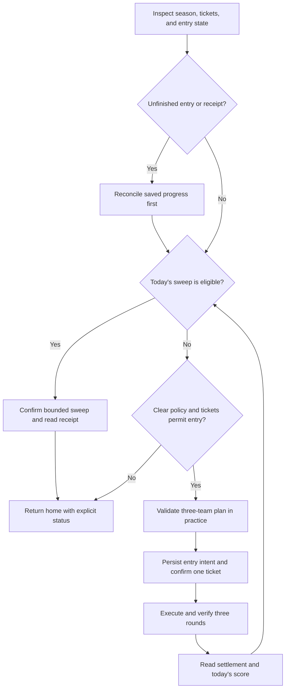

# Joint Firing Drill — design proposal

**Status:** design only. No runner, settings, or game actions are implemented by this document.

**Reviewed:** September 28, 2026.

the idea: get three teams that actually work, prove it in practice, do the daily clear, then sweep what we can. don't burn tickets finding out that we used every good student on the first team.

This extends the [project design](design.md). Joint Firing Drill is its own mode, separate from [Total Assault](total-assault.md) and [Final Restriction Release](final-restriction-release.md). It uses the existing serial queue, deterministic recognition, receipt logging, and per-instance lock. No runtime AI is required.

## Rules we can establish before implementation

The official [Joint Firing Drill guide](https://forum.nexon.com/bluearchive-en/board_view?board=3222&thread=2523189), marked current through December 24, 2024, describes four rotating drill types: Shooting, Defense, Escort, and Breakthrough. Entry is through Campaign after Normal 5-3. Tickets replenish to three at 19:00 UTC without accumulating unused tickets. Practice is free. Students used in successful rounds become unavailable for subsequent rounds of that entry; unsuccessful attempts do not consume their availability. One assistant can be borrowed across the three rounds, with a fee and formation restrictions.

The official [March 12 patch notes](https://forum.nexon.com/bluearchive-en/board_view?board=3217&thread=2519898) describe a ticket-funded entry containing three rounds, a one-hour entry deadline, four selectable stages, and permission to repeat a stage. Interrupted entries can resume within their deadline; expiry or quitting settles partial progress. Sweeps cost tickets and award coins and credits according to the day's best score.

**Unresolved wording:** both sources describe sweep availability with “only available once.” They do not clearly establish whether this means one initial clear, one sweep operation, or another restriction. Capture the current sweep UI, quantity limits, confirmation, and post-sweep state before implementing a remaining-ticket loop. The proposed behavior is to sweep all eligible tickets above the reserve, subject to the observed rules. Never assume a second full entry is wanted when sweeping is unavailable.

These references establish a baseline, not the current season's rules. Inspect the live season, stages, restrictions, fees, practice behavior, and screens before enabling spending.

## Scope and defaults

Expose **Joint Firing Drill** in Settings with three policies:

| Policy | Behavior |
| --- | --- |
| Inspect only | Read availability, tickets, progress, and setup requirements; spend nothing. Default. |
| Sweep only | Use an existing qualifying clear from today. If none exists, ask for a manual clear or an enabled clear policy. |
| Practice, clear, and sweep | Validate a complete three-team plan, perform one real entry, then sweep eligible remaining tickets. |

Daily inclusion is off by default. Proposed defaults when enabled are zero reserved tickets, stages `[2, 2, 2]`, game Auto skills, a 30-second practice victory margin, and assistants disabled. Stage 2 is a starting target for validation, not a claim that the account can beat it. Each round's target is independently configurable from 1–4; there is no assumption that three stage-4 teams are available.

Start with three player-prepared formations. Allow an explicitly enabled, prevalidated lower-stage fallback, but never quietly lower the requested target. Show the actual completed stage tuple and score. Do not buy tickets, upgrade students, purchase shop items, or run repeated paid entries to chase a better score. A manual clear made earlier today can satisfy sweep eligibility without replaying combat.

## Plan all three teams together

Treat the entry as one allocation problem. Read each formation's student identities, roles, slot order, and starting skills. Detect overlap between owned students across successful-round teams before practice. Keep borrowed and owned copies distinguishable; cross-round duplicate and assistant rules need their own live fixtures rather than a blanket name-based ban.

The first implementation preserves player-prepared teams and reports missing or conflicting slots. Do not fill them indiscriminately with the highest-level students. Different drills can require healing, crowd control, hit counts, or other mechanics that raw level and damage type do not capture.

A later deterministic planner can use versioned local JSON profiles. A profile identifies the season, drill type, terrain, armor, special rules, acceptable stage tuple, three ordered teams, required roles, allowed substitutions, and any supported skill sequence. Validate against a strict schema. Unsupported rules or an uncertain season match hold combat and provide setup guidance. Profile files contain data, not arbitrary executable code.

Optimize the complete plan for reliable clears first and projected score second. Bound the number of candidate plans rather than testing every roster combination. A change to one team must recheck conflicts with both others. Do not reuse Total Assault's least-damage substitution rule: a low-damage healer or control student may be essential here.

Assistant support is a later opt-in increment. Reserve the single borrow for a specified round, verify the actual offering and fee, and enforce an explicit credit limit. Practice must use the same assistant as the real formation. If availability changes, invalidate the affected plan before paid entry. Do not borrow a replacement midway through an entry without evidence that the game permits it.

## Practice qualification

Before a new real entry, require a readable practice victory for each planned team at its selected stage. Confirm Auto and the starting formation. Read remaining time, score, and the settled result; an animation or apparent enemy defeat is not enough. The victory margin is configurable and measured against the displayed battle timer.

Practice may not simulate the complete entry's student locks. Therefore, qualification includes an independent three-team compatibility check even if each individual mock wins.

Store a qualification signature covering season/rules, stage, formation and slot order, assistant identity, starting skills, and combat policy. Reuse it within the current game day only while those observations still match. A new day, season change, altered formation, or failed real round invalidates relevant qualification. Unknown investment changes require requalification rather than an assumed match.

Proposed limit: six practice battles per game day across queue continuations, with no identical failed setup retried automatically. This permits one original and one revised plan across three teams. Persist the budget so restarts do not renew it. An unsuccessful practice ends spending eligibility with a useful reason; independent daily work continues.

## Execution and durable recovery

Proposed persisted state includes instance, server, season signature, server game day, ticket observation, reserved tickets, qualification records, practice budget, entry intent, entry deadline, completed round scores, used-student identities, assistant usage, pending settlement/sweep intent, and evidence references. Schema validation and atomic writes follow the existing task-state pattern.

Persist intent **before** confirming entry or sweep. Verify the ticket delta and observed entry state afterward. A round advances only on a confirmed result and entry-progress update. Settlement requires receipt recognition; write coins and credits to Loot Gathered through the shared receipt pipeline. An estimated score payout is not received loot.

On restart, reconcile the current screen with durable state. Resume an active entry, read an open result, or resolve a completed settlement before considering a new ticket. Never replay an ambiguous confirmation. If the deadline expired, inspect partial settlement; do not record a three-round clear or assume sweep eligibility. Preserve unresolved intents across daily and season rollover.

A confirmed real-round loss permits at most one prequalified alternative using still-available students, if configured and enough entry time remains. Otherwise hold the entry and notify the player with its deadline. Do not repeatedly retry or automatically forfeit. An unreadable result is unresolved, not a loss. The hold is visible and cannot be silently reset by “do everything.”

## Queue integration

Add a badge-independent inspection to enabled Daily and “do everything,” deduplicated against queued or active work. Periodic check-ins may retry eligible inspection after a bounded transient failure; closed/preparation seasons and exhausted tickets are normal outcomes. Notification dots never enable ticket spending.

Practice runs one mock per queue visit, yields home, and lets due AP, Cafe, and Crafting work run before another mock. Once a paid entry begins, finish its three rounds in one bounded visit where possible: its deadline makes arbitrary interleaving undesirable. Admission requires enough time before the earlier of season end or daily reset to cover the validated entry budget, plus a safety margin. Drain urgent AP work before starting; never begin practice when recovery of an existing paid entry is needed.

Add shared pending-entry protection to Restart, idle-close, and unrelated task startup. A pause stops further input at a safe boundary and exposes any active entry deadline; it does not cancel the game's timer. Resume reconciles first. Device loss or an unrecognized active battle must not trigger a force restart that discards result evidence.

Mode-specific setup failures hold this mode. They must not stop all daily jobs once home and safe device ownership are established. A failure to establish safe navigation still stops device input. Every error notice links to the actual screenshot trace.

## Dashboard and implementation boundaries

Show policy, per-round target stages, ticket reserve, practice margin, fallback switch, and team setup status. Advanced assistant controls appear only when supported. Show progress as `round 2/3`, not three independent ticket jobs. Important Actions and `YYYY-MM-DD.log` record plan selection, practice outcomes, ticket use, round scores, recovery, settlement, and reasons for skipping. Keep local account screenshots out of Git.

Proposed modules are `joint_firing_drill.py` for orchestration, `drill_vision.py` for observed screens, `drill_policy.py` for pure planning/eligibility, and `drill_state.py` for persistence. These names and settings are proposals, not usable commands. Reuse device scaling, native OCR, locks, queue continuations, logs, and loot recognition; do not copy Total Assault's single-team state machine.

## Rollout and acceptance criteria

1. **Inspect:** capture sanitized fixtures for entry/preparation screens, stages, ticket counts, all relevant formations, and sweep controls. Verify current mechanics, including the ambiguous sweep limit and assistant behavior.
2. **Practice:** prove three compatible prepared teams without tickets. Test mismatched profiles, duplicate students, animation delays, losses, budget exhaustion, pause/resume, and 1440p at 20 FPS.
3. **One entry:** with authorization to spend, validate one ticket decrement, three confirmed rounds, used-student tracking, final score, complete receipt, and return home. Exercise interruption recovery offline before the live entry.
4. **Sweeps and scheduling:** validate supported quantities and remaining-ticket behavior, reserves, manual clears, daily reset, downtime catch-up, and queue deduplication. Show that AP and Cafe work are not starved during practice.
5. **Optional expansion:** assistants, reviewed substitutions, and mechanic-specific skill scripts follow separately. Each needs new evidence and tests.

Regression tests must cover crashes before/after each spending confirmation, contradictory ticket observations, expired entries, partial settlement, missing receipts, changed assistants, and season rollover with pending state. No test may treat a mock as a paid clear or a ticket decrement alone as proof of loot.

**Live status:** nothing in this proposal has been validated on the account. A completed implementation must document which drill types, stage rules, team policies, and recovery paths actually passed, without generalizing one season's success to every drill.
