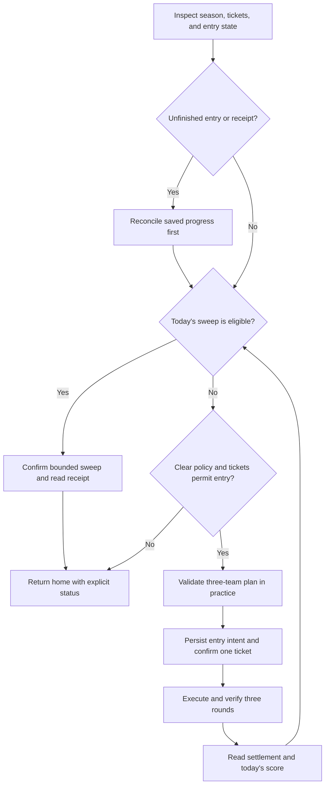

# Joint Firing Drill

**Status:** Shooting Drill MVP implemented. Prepared teams, practice qualification, paid entry, assistant fee checks, reward collection, and remaining-ticket sweeps have live evidence. The broader design below includes future work; see the implementation boundary section.

**Reviewed:** September 29, 2026.

the idea: get three teams that actually work, prove it in practice, do the daily clear, then sweep what we can. don't burn tickets finding out that we used every good student on the first team.

This extends the [project design](design.md). Joint Firing Drill is its own mode, separate from [Total Assault](total-assault.md) and [Final Restriction Release](final-restriction-release.md). It uses the existing serial queue, deterministic recognition, receipt logging, and per-instance lock. No runtime AI is required.

## Rules we can establish before implementation

The official [Joint Firing Drill guide](https://forum.nexon.com/bluearchive-en/board_view?board=3222&thread=2523189), marked current through December 24, 2024, describes four rotating drill types: Shooting, Defense, Escort, and Breakthrough. Entry is through Campaign after Normal 5-3. Tickets replenish to three at 19:00 UTC without accumulating unused tickets. Practice is free. Students used in successful rounds become unavailable for subsequent rounds of that entry; unsuccessful attempts do not consume their availability. One assistant can be borrowed across the three rounds, with a fee and formation restrictions.

The official [March 12 patch notes](https://forum.nexon.com/bluearchive-en/board_view?board=3217&thread=2519898) describe a ticket-funded entry containing three rounds, a one-hour entry deadline, four selectable stages, and permission to repeat a stage. Interrupted entries can resume within their deadline; expiry or quitting settles partial progress. Sweeps cost tickets and award coins and credits according to the day's best score.

**Sweep wording resolved:** [Game8's walkthrough](https://game8.jp/blue-archive/653326) explains that one clear each day unlocks sweeping. [Global players describe the exact daily sequence](https://www.reddit.com/r/BlueArchive/comments/1s3ulbf/daily_questions_megathread_march_26_2026/): clear three rounds with the first ticket, then sweep the other two runs. The official English wording does not mean a one-ticket sweep limit. With three starting tickets and no reserve, the intended plan is **one three-round entry → two swept entries**. Repeat the qualifying clear on each new game day.

The walkthrough also confirms that a borrowed copy may be used in another team after using the owned copy. Keep those identities separate. The [fan wiki's assistant reference](https://bluearchive.fandom.com/wiki/Circle) describes distinct variants as separate units, no mock borrowing fee, and expected real borrowing fees of 40,000 credits for friends/club or 50,000 otherwise. Verify the displayed fee before confirming; the price reference is not spending authorization.

Use walkthroughs and fan wikis to resolve unclear rule translations before implementation. Distinguish JP season examples from Global: a guide's current team or schedule is not proof of the account's active season. Recognition is calibrated against the observed English client; other drill types need their own fixtures.

## Scope and defaults

Expose **Joint Firing Drill** in Settings with three policies:

| Policy | Behavior |
| --- | --- |
| Inspect only | Read availability, tickets, progress, and setup requirements; spend nothing. Default. |
| Sweep only | Use an existing qualifying clear from today. If none exists, ask for a manual clear or an enabled clear policy. |
| Practice, clear, and sweep | Validate a complete three-team plan, perform one real entry, then sweep eligible remaining tickets. |

Daily inclusion is off by default. Defaults when enabled are zero reserved tickets, stages `[2, 2, 2]`, game Auto skills, a 30-second practice victory margin, and a 40,000-credit assistant fee ceiling (set to zero to prevent borrowing). Stage 2 is a starting target for validation, not a claim that the account can beat it. Each round's target is independently configurable from 1–4; there is no assumption that three stage-4 teams are available.

Start with three player-prepared formations. Allow an explicitly enabled, prevalidated lower-stage fallback, but never quietly lower the requested target. Show the actual completed stage tuple and score. Do not buy tickets, upgrade students, purchase shop items, or run repeated paid entries to chase a better score. A manual clear made earlier today can satisfy sweep eligibility without replaying combat.

## Plan all three teams together

### Observed Shooting Drill: September 29, 2026

The live menu identifies Shooting Drill, urban terrain, and light armor. Stage 2
has no additional special rules. Stage 4's inspected tooltips explicitly identify
increased Special-student damage and increased Box Cat defense. These observations
take precedence over older season guides.

Shooting Drill is a single-target damage race against a target that does not attack;
defensive durability and healing are not objectives. Prefer effective single-target
damage, damage amplification, defense reduction, and cost support. For this season's
higher stages, account for the Special-student damage bonus rather than ranking all
students by level or Striker damage alone. A tank or healer may still merit a slot
for an offensive buff or debuff; classify their contribution, not just their role.
This is specific to Shooting Drill, not a policy for Defense, Escort, or Breakthrough.

References: [Shooting Drill walkthrough](https://note.com/ripple43/n/n87f5445147e0),
[September 29 Global discussion](https://www.reddit.com/r/BlueArchive/comments/1wt1917/joint_firing_drill_shooting_drill_929_105_mon_659/).
The live account shows **3/6 tickets**; capacity must be read from the client, not
hard-coded from the older three-ticket guide. No paid tickets have been spent in
this initial screen inspection.

### Team allocation

Treat the entry as one allocation problem. Read each formation's student identities, roles, slot order, and starting skills. Detect overlap between owned students across successful-round teams before practice. Identify a student by variant and ownership/lender, not character name alone. An owned copy and borrowed copy may occupy different round teams; the same variant cannot be duplicated within one formation. Add fixtures for those distinctions.

The first implementation preserves player-prepared teams and reports missing or conflicting slots. Do not fill them indiscriminately with the highest-level students. Different drills can require healing, crowd control, hit counts, or other mechanics that raw level and damage type do not capture. For example, the [JFD 13 walkthrough](https://bluearchive.gg/joint-firing-drill-13-breakthrough-guide/) describes a season where damage-over-time triggers receive a large bonus and Midori needs Momoi to activate her poison. Encode such dependencies in the matching season profile; do not generalize that team to other seasons.

A later deterministic planner can use versioned local JSON profiles. A profile identifies the season, drill type, terrain, armor, special rules, acceptable stage tuple, three ordered teams, required roles, allowed substitutions, and any supported skill sequence. Validate against a strict schema. Unsupported rules or an uncertain season match hold combat and provide setup guidance. Profile files contain data, not arbitrary executable code.

Optimize the complete plan for reliable clears first and projected score second. Bound the number of candidate plans rather than testing every roster combination. A change to one team must recheck conflicts with both others. Do not reuse Total Assault's least-damage substitution rule: a low-damage healer or control student may be essential here.

Assistant support is included in the requested implementation. Reserve the single borrow for one specified round across the entire entry, verify the actual offering and fee, and enforce an explicit credit limit. Both Striker and Special assistants are valid planning candidates; role must match the slot. Practice must use the exact same lender offering as the real formation. If availability changes, invalidate the affected plan before paid entry. An owned copy may appear in a different round from its borrowed copy, but neither two borrows across rounds nor duplicate variants within a formation are allowed. Do not borrow a replacement midway through an entry without evidence that the game permits it. The September 29 live run verified one borrowed assistant in both practice and the paid entry, including its 40,000-credit fee.

## Practice qualification

Before a new real entry, require a readable practice victory for each planned team at its selected stage. Confirm Auto and the starting formation. Read remaining time, score, and the settled result; an animation or apparent enemy defeat is not enough. The victory margin is configurable and measured against the displayed battle timer.

Practice may not simulate the complete entry's student locks. Therefore, qualification includes an independent three-team compatibility check even if each individual mock wins.

Store a qualification signature covering season/rules, stage, formation and slot order, assistant identity, starting skills, and combat policy. Reuse it within the current game day only while those observations still match. A new day, season change, altered formation, or failed real round invalidates relevant qualification. Unknown investment changes require requalification rather than an assumed match.

Proposed limit: six practice battles per game day across queue continuations, with no identical failed setup retried automatically. This permits one original and one revised plan across three teams. Persist the budget so restarts do not renew it. An unsuccessful practice ends spending eligibility with a useful reason; independent daily work continues.

## Execution and durable recovery

Proposed persisted state includes instance, server, season signature, server game day, ticket observation, reserved tickets, qualification records, practice budget, entry intent, entry deadline, completed round scores, used-student identities, assistant usage, pending settlement/sweep intent, and evidence references. Schema validation and atomic writes follow the existing task-state pattern.

Persist intent **before** confirming entry or sweep. Verify the ticket delta and observed entry state afterward. A round advances only on a confirmed result and entry-progress update. Settlement requires receipt recognition; write coins and credits to Loot Gathered through the shared receipt pipeline. An estimated score payout is not received loot.

On restart, reconcile the current screen with durable state. Resume an active entry, read an open result, or resolve a completed settlement before considering a new ticket. Never replay an ambiguous confirmation. If the deadline expired, inspect partial settlement; do not record a three-round clear or assume sweep eligibility. Preserve unresolved intents across daily and season rollover.

A confirmed real-round loss permits at most one prequalified alternative using still-available students, if configured and enough entry time remains. Otherwise hold the entry and notify the player with its deadline. Do not repeatedly retry or automatically forfeit. An unreadable result is unresolved, not a loss. The hold is visible and cannot be silently reset by “do everything.”

## Queue integration

Add a badge-independent inspection to enabled Daily and “do everything,” deduplicated against queued or active work. Periodic check-ins may retry eligible inspection after a bounded transient failure; closed/preparation seasons and exhausted tickets are normal outcomes. Notification dots never enable ticket spending.

Practice runs one mock per queue visit, yields home, and lets due AP, Cafe, and Crafting work run before another mock. Once a paid entry begins, finish its three rounds in one bounded visit where possible: its deadline makes arbitrary interleaving undesirable. Admission requires enough time before the earlier of season end or daily reset to cover the validated entry budget, plus a safety margin. Drain urgent AP work before starting; never begin practice when recovery of an existing paid entry is needed.

Add shared pending-entry protection to Restart, idle-close, and unrelated task startup. A pause stops further input at a safe boundary and exposes any active entry deadline; it does not cancel the game's timer. Resume reconciles first. Device loss or an unrecognized active battle must not trigger a force restart that discards result evidence.

Mode-specific setup failures hold this mode. They must not stop all daily jobs once home and safe device ownership are established. A failure to establish safe navigation still stops device input. Every error notice links to the actual screenshot trace.

## Dashboard and implementation boundaries

Show policy, per-round target stages, ticket reserve, practice margin, fallback switch, and team setup status. Advanced assistant controls appear only when supported. Show progress as `round 2/3`, not three independent ticket jobs. Important Actions and `YYYY-MM-DD.log` record plan selection, practice outcomes, ticket use, round scores, recovery, settlement, and reasons for skipping. Keep local account screenshots out of Git.

Modules are `joint_firing_drill.py` for orchestration, `drill_vision.py` for observed screens, `drill_policy.py` for pure planning/eligibility, and `drill_state.py` for persistence. The runner and settings use these names. Reuse device scaling, native OCR, locks, queue continuations, logs, and loot recognition; do not copy Total Assault's single-team state machine.

## Rollout and acceptance criteria

1. **Inspect:** capture sanitized fixtures for entry/preparation screens, stages, ticket counts, all relevant formations, and sweep controls. Calibrate the researched clear-once/sweep-twice flow, assistant identity distinctions, and fee recognition against the current client.
2. **Practice:** prove three compatible prepared teams without tickets. Test mismatched profiles, duplicate students, animation delays, losses, budget exhaustion, pause/resume, and 1440p at 20 FPS.
3. **One entry:** with authorization to spend, validate one ticket decrement, three confirmed rounds, used-student tracking, final score, complete receipt, and return home. Exercise interruption recovery offline before the live entry.
4. **Sweeps and scheduling:** validate the two remaining daily sweeps, supported quantity controls, reserves, manual clears, daily reset, downtime catch-up, and queue deduplication. Show that AP and Cafe work are not starved during practice.
5. **Assistant validation and expansion:** verify the single borrowed offering in practice and the paid entry, including fees and changed availability. Reviewed substitutions and mechanic-specific skill scripts follow separately. Each needs new evidence and tests.

Regression tests must cover crashes before/after each spending confirmation, contradictory ticket observations, expired entries, partial settlement, missing receipts, changed assistants, and season rollover with pending state. No test may treat a mock as a paid clear or a ticket decrement alone as proof of loot.

**Live status (September 29):** all three prepared teams won their free practices and the real Shooting Drill at stages `[2, 1, 1]`, scoring 65,729 points. The first team used one exact, previously qualified borrowed Hina (Dress), with a verified 40,000-credit fee. Settlement and both remaining-ticket sweeps were received and inspected; the ticket balance reached zero. Sweep receipt recovery was exercised live after an unrecognized empty sweep panel, without repeating spending. Other recovery branches have offline coverage only.

## Implemented MVP and remaining design work

The current runner uses three **prepared in-game formations**, validates distinct owned students and at most one exact assistant offering, and practices each team before spending. It uses empty starting-skill selections and game Auto. Settings expose daily inclusion, inspect/sweep-only/clear-and-sweep policy, three target stages, reserved tickets, practice margin, and assistant credit ceiling. Daily and “do everything” include enabled Drill work without requiring a notification dot.

Intent is persisted before spending. Round results, receipt evidence, and ticket balances reconcile interrupted entries and sweeps. Uncertain confirmations are held rather than replayed. Pending entries also block unrelated restart/idle-close behavior. Sanitized screen fixtures and regression tests cover recognition and spending recovery.

The following design elements remain future work: automatic roster construction and seasonal profiles; automatic replacement teams after losses; custom skill scripts; other drill types and closed-season recognition; one-mock-per-visit scheduling; and deadline-aware admission/partial settlement. Practices currently run together in one bounded visit. A prepared team that cannot qualify stops this mode with a setup error. A real-round failure holds the active entry for review. These limitations must not be presented as a fully autonomous seasonal team optimizer.

### Assistant identity after practice

A September 29 daily visit won its first practice, but a redundant ownership
inspection discarded the already verified assistant lender. Its team fingerprint
then differed from the prepared plan, so the runner stopped before paid entry.
Practice now retains the exact team verified immediately before opening the
formation. It checks the visible six students again before and after starting-skill
inspection; any change still stops mobilization. Tests cover retaining the lender
in the winning proof and rejecting changed students before recording an attempt.

An interrupted free practice can expire and show its partial summary immediately
on entering Drill. The runner now saves and acknowledges that explicitly recognized
mock summary, then returns to the lobby. It refuses this recovery if a paid entry
or sweep is unresolved. The September 29 recovery exercised this path live; the
fixture and runner tests also cover the pending-transaction refusal.

Assistant scans use overlapping 80-pixel drags in the gap between cards. A short
drag through a card at 20 FPS selected a different student during paid-entry
restoration; the exact-lender guard stopped before mobilization or the assistant
fee. Moving the gesture off the cards preserves that guard while avoiding the
accidental selection. A failed restoration keeps the existing ticket intent;
recovery must resume that entry instead of purchasing another.

The native-resolution assistant fee screen also exercises close-up OCR for the
rarity digit. Two high-confidence crops must agree when full-screen OCR and the
portrait-dependent badge template miss it. A conflicting existing read is retained
and rejected; exact fee, assistant level, rarity, badge, and credit icon checks
still gate payment. Regression coverage includes disagreement and low confidence.

The September 29 post-reset recovery also completed live: all three practices
qualified, the retained paid entry won all three rounds for 65,224 points, and
the remaining two tickets were swept. Reward receipts were itemized, the final
ticket balance reached zero, pending transaction state cleared, and the runner
returned home. The exact assistant fee was confirmed once while resuming the
saved entry. The revised scrolling gesture has regression coverage but was not
needed in this successful retry because the retained offering was already visible.
